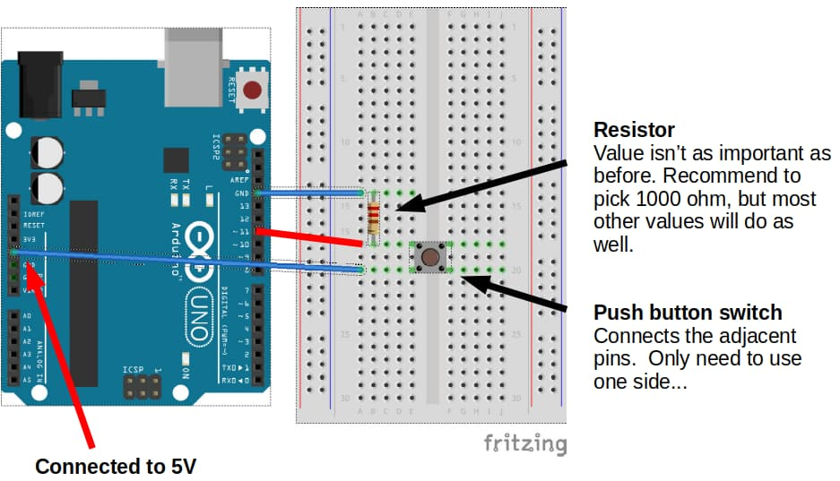

# Introducing C/C++ for IoT

[S02-Intro-to-C-Part-10.md](S02-Intro-to-C-Part-10.md) | [S02-Intro-to-C-Part-12.md](S02-Intro-to-C-Part-12.md)


# Digital Input  

## Button  
  
Connect a button to your Arduino as follows...  
  
  
  
Now enter and simulate the following code.  
  
```cpp  
void setup() {  
    pinMode(13, OUTPUT);
}  
  
void loop() {  
    if (digitalRead(11) == HIGH) {    
        digitalWrite(13, HIGH);  
    } else {
        digitalWrite(13, LOW);  
    }
}  
```  
  
`pinMode(13, OUTPUT)` 
- Set pin 13 (built-in LED) to `OUTPUT` mode.  
- We are using pin 11 (button) in `INPUT` mode, and since that is the default, we don't need to do anything for pin 11.  
  
`if (digitalRead(11) == HIGH)` 
- This checks if pin 11 is `HIGH`.  
- If the button is pressed, pin 11 will be connected directly to **5V** (HIGH).  
- If the button is not pressed, pin 11 will be connected to **GND** (LOW) through the resistor.  
  
Simulate your code. 

If your wiring and code is correct, the built-in LED should turn on when the button is pressed, and off when it is released.  
  
## Button Toggle  
  
To toggle the LED, we'll need to keep track of whether it is off or on using a variable.

Whenever the button is pressed, we'll check if the LED is on:
- if it is on, we'll turn it off, 
- and if it is off, we'll turn it on.  
  
We'll also need to add a short delay, so that the LED won't keep switching between on and off.  
  
```cpp
bool ledOn = false;  
  
void setup() {  
  pinMode(13, OUTPUT);
}  
  
void loop() {  
    if (digitalRead(11) == HIGH) {    
        if (ledOn) {   
            digitalWrite(13, LOW);
            ledOn = false; 
        } else {     
            digitalWrite(13, HIGH);   
            ledOn = true;  
        }   
    delay(500);  
    }
}  
```  
  
Simulate your code. 

If your wiring and code is correct, the built-in LED should switch between off and on 
when the button is pressed.  

Try holding the button down and see what happens. 

Experiment with changing the delay duration.  
  
