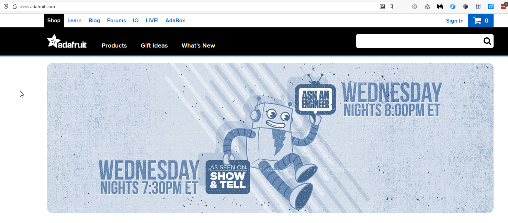
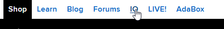
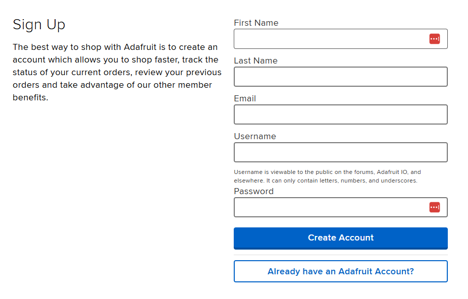
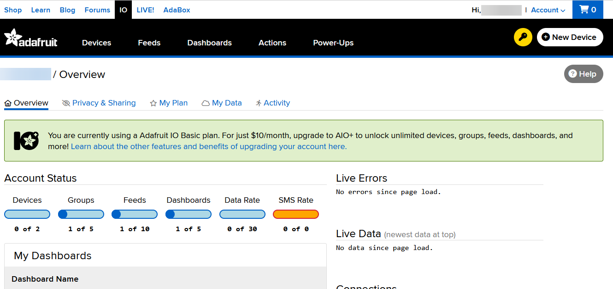
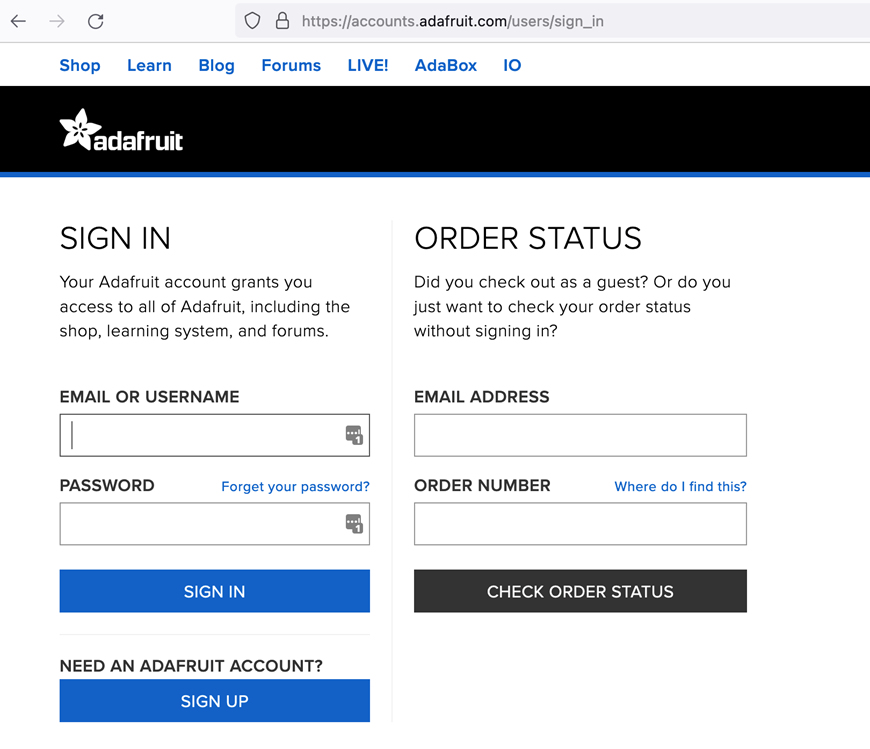
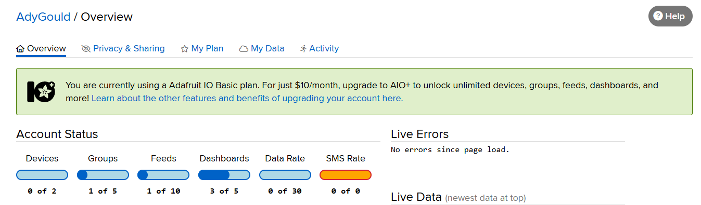
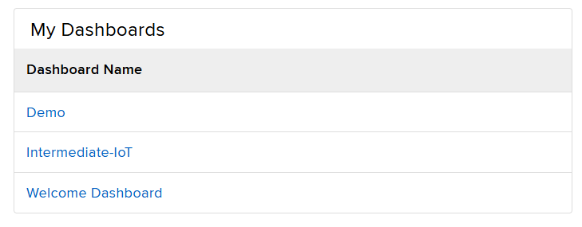
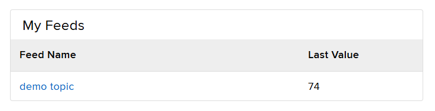

# Adafruit - Setting Up and Using

<br>

### Authors:
- Sander Huijsen (previous staff member)
- Adrian Gould (Perth campus)
- Murray Hay (Joondalup campus)


<div @click="$slidev.nav.next" class="mt-4 -mx-4 p-4" hover:bg="white op-10">
<p>Press <kbd>Space</kbd> or <kbd>RIGHT</kbd> for next slide/step <fa7-solid-arrow-right /></p>
</div>


<div class="abs-br m-6 text-xl">
  <a href="https://github.com/adygcode/SaaS-FED-Notes" target="_blank" class="slidev-icon-btn">
    <fa7-brands-github class="text-zinc-300 text-3xl -mr-2"/>
  </a>
</div>


<!--
The last comment block of each slide will be treated as slide notes. It will be visible and editable in Presenter Mode along with the slide. [Read more in the docs](https://sli.dev/guide/syntax.html#notes)
-->


---
layout: default
level: 2
---

# Navigating Slides

Hover over the bottom-left corner to see the navigation's controls panel.

## Keyboard Shortcuts

|                                                     |                             |
|-----------------------------------------------------|-----------------------------|
| <kbd>right</kbd> / <kbd>space</kbd>                 | next animation or slide     |
| <kbd>left</kbd>  / <kbd>shift</kbd><kbd>space</kbd> | previous animation or slide |
| <kbd>up</kbd>                                       | previous slide              |
| <kbd>down</kbd>                                     | next slide                  |

---
layout: section
---

# Objectives

---
level: 2
layout: two-cols
---

# Objectives

::left::


::right::


---
level: 2
layout: figure-side
figureUrl: public/orly-book-cover-dashboards.png
---

# Contents

<Toc minDepth="1" maxDepth="1" />

---
layout: section
---

# 🌟 Ice Breaker

## TODO: Add ice-breaker


---
layout: section
---

# Who are Adafruit

---
level: 2
---

# Who is Adafruit

### What it is
- An open‑source hardware and electronics education company
### What they do
- Design, manufacture, and sell DIY electronics and learning kits
### Who it’s for
- Makers, students, educators, and engineers

<!--
Presenter notes:
- Adafruit is well known in the maker and STEM education space
- Strong emphasis on learning, accessibility, and open-source values
-->

---
level: 2
layout: two-cols
---

# Who is Adafruit

<br>

## What Adafruit Supplies

::left::

### Hardware
- Microcontrollers, sensors, displays, LEDs, robotics parts

<br>
<br>

### Platforms 
- Adafruit Feather, Metro, QT Py, Trinket boards


::right::

### Learning resources 
- Tutorials, guides, libraries, example projects

<br>
<br>

### Accessories 
- Cables, breadboards, tools, wearables, kits


<!--
Presenter notes:
- Many products are designed to work well with Arduino, CircuitPython, and Raspberry Pi
- Their documentation is a major reason educators choose Adafruit
-->


---
layout: section
---

# Adafruit Accounts

## Creating

## Logging-in

---
level: 2
layout: two-cols
---

# Creating an Adafruit Account

<br>

## Creating an Account

::left::

Open your browser and go to: https://adafruit.com

::right::



---
level: 2
---

# Creating an Adafruit Account

## Creating an Account 2

Click on the IO menu option.




Click on the "Get Started For Free" option on the right of the new menu bar:


---
level: 2
layout: two-cols
---

# Creating an Adafruit Account

<br>

## Creating an Account 3

::left::

Fill out the form using:
- Your given name
- The first initial of your surname
- Your student email address
- A suitable (TAFE appropriate) username
- A password

::right::




---
level: 2
---

# Creating an Adafruit Account

## Creating an Account 4


Click on Create Account.

It will set up your free account and then take you to your dashboard.




---
level: 2
layout: two-cols
---

# Logging Into Your Adafruit Account

If you are not logged into your account then you will need to sign in.

Follow these steps...

::left::

Open your browser and go to: https://adafruit.com

::right::


---
level: 2
layout: two-cols
---
# Logging Into Your Adafruit Account 

::left::

Click on the IO menu option.

<br>
<br>

Click Sign In.

Fill out the Sign In section using the email address and password you created previously.

::right::





---
layout: section
---

# Adafruit Dashboard parts

---
level: 2
layout: two-cols
---

# Adafruit Dashboard parts

::left::

## Overview

The overview shows account details and other information.

Part of the overview is a list of dashboards and feeds.

::right::




---
level: 2
layout: two-cols
---

# Adafruit Dashboard parts

::left::

## Dashboards

- Visual interface to display data from feeds.
- Dashboards are customisable.
- Dashboards may include various widgets



::right::

## feeds

- Aka MQTT Topics
- Send data to a feed
- Read data from a feed




---
level: 2
layout: two-cols
---
# Adafruit Dashboard parts

::left::

## Feeds (aka topics)

To view your feeds, click on the Feeds menu option.


::right::
<br>

This displays list of feeds:


---
level: 2
layout: two-cols
---

# Adafruit Dashboard parts

::left:: 

### Adding Feeds

Click "New Feed" to create a new feed.

Enter the details into the modal dialog:

<Announcement type="warning" title="Important">
<p><strong>Strongly</strong> suggest <strong>NOT</strong> including 
spaces in feed names</p>
<p>Examples: <code>NMT-IoT-LED/data</code>, 
<code>nmt-iot-led/data</code>,
or <code>NMT-IoT-LED-data</code></p>
<p>Group feeds & sub-topics using a <code>/</code></p>
</Announcement>

::right::


---
level: 2
layout: two-cols
---

# Adafruit Dashboard parts

::left:: 

### Adding Feeds

Click Create once you have added at least the feed name.

<Announcement type="warning" title="Important">
<p>Feed keys <code>/</code> becomes <code>-slash-</code></p>
</Announcement>

::right::

### Topic Name (aka Key)

The "**key**", or topic name, that you will use with MQTT is shown once the topic/feed is created:


---
level: 2
layout: two-cols
---

# Adafruit Dashboard parts

::left::

## Feed Information & Key

Writing code for MQTT & Adafruit requires:

- The feed information,
- Feed key

Locate feed info by: 
- Clicking the Feed name
- Click Feed Info

This reveals:
- API, Web and MQTT endpoint details

::right::


---
level: 2
---

# Adafruit Dashboard parts

## Adafruit Key Details

- Service is secured.
- Require Adafruit "My Key" details.
- Allows logging into your Adafruit account 
- Allows sending data to topics/feeds.

---
level: 2
layout: two-cols
---


# Adafruit Dashboard parts

## Viewing Adafruit Key Details

::left::

- Locate and click the key icon (top-right)


- New dialog displays account username and active key

<br>
<Announcement type="warning" title="DO NOT SHARE THESE DETAILS">
<ul>
<li>Handle this information with care.</li>
<li>Treat it like you treat your passwords.</li>
</ul>
</Announcement>

::right::


---
level: 2
layout: two-cols
---
# Exercise

::left::

## Adafruit Account Setup

- Create your Adafruit account
- Log in to your account
- Explore the dashboard and its features
- Create a feed (topic) for your IoT device
- Note down the feed key and your account key for later use

::right::
 
## Items to consider

Before continuing:

- Browse over the Adafruit account details
- Check out the plan and its **limitations**
	- E.g., mind the rate limit…


---
layout: section
---

# Adafruit and MQTT

---
level: 2
---

# Adafruit and MQTT

## Question: What are the free Adafruit account limitations?

- Free accounts are deliberately constrained to prevent overload
- Suitable for classroom demos and beginner IoT projects

<!-- Presenter notes:

- **Data rate:** Limited number of data updates per minute
- **Storage:** Short data retention period
- **Features:** Basic dashboards and feeds only
- **Usage:** Intended for learning, prototypes, and small projects

- **Data publishing:** ~30 data points per minute (shared across devices) [1](https://github.com/adafruit/Adafruit_IO_Documentation/blob/main/source/includes/mqtt/_rate_limiting.md.erb)
- **Feeds & dashboards:** Limited compared to paid plans [2](https://io.adafruit.com/faq)
- **Automation & alerts:** Advanced actions (email/SMS) not included [2](https://io.adafruit.com/faq)
- **Data history:** Shorter retention window than IO+ [3](https://io.adafruit.com/plus)

-->

---
level: 2
---

# Adafruit and MQTT
<br>

<Announcement type="warning" title="Important" style="padding: 1rem 1rem 0;">
<p style="padding-left: 2rem; padding-right: 2rem;">Keep secret keys safe!
</p>
</Announcement>

## Best Practices for "Secrets"

- store secrets in a separate `secrets.h` file
- only publish to GitHub if a private repo
- better to publish a "placeholder" version of secrets
- share secrets via other methods as needed


---
level: 2
---

# Secrets File

````md magic-move

```cpp [C++] {all}
/**
 * Secrets file for MQTT & WiFi
 *
 * This file contains sensitive information such as:
 * - MQTT broker details
 * - Adafruit account credentials
 * - Wi-Fi credentials
 *
 * Filename:           secrets.h
 * Author:             YOUR NAME
 */

/* Definitions follow */
```

```cpp [C++] {1-4|6-9|10|12-18|all}
/* Definitions of Secrets */

#define IO_BROKER "io.adafruit.com"
#define IO_PORT 1883

#define IO_CLIENTNAME  "..."
#define IO_USERNAME  "...."
#define IO_KEY       "...."

#define IO_DATA_PUB     IO_USERNAME "/feeds/feed-key"

const char* WIFI_SSID = "...";      // used by init Wi-Fi
const char* WIFI_PASS = "...";      // used by init Wi-Fi
const char* hostname  = IO_BROKER ;  // used by init Wi-Fi
```

````

---
level: 2
---


# Secrets File

## Including in your code

Use the following line to include the secrets file in your code:

```cpp
#include "secrets.h"
```

We strongly suggest including this:
- immediately after importing libraries
- before any code that references the secrets

This will assist with:
- simplifying the updating secrets (1 file, not multiple)
- enhance security (isolates sensitive information from the main codebase)
- facilitating sharing code without exposing secrets (e.g., when publishing 
  to GitHub)


---
level: 2
---


---

# Acknowledgements & References

- TODO: Add references etc

> - Some content was generated with the assistance of Microsoft Copilot

---
layout: end
---

# Remember: 🦆

### With Laravel and Pest:

- your code can be clean,
- your tests can be sharp, and...
- according to the rubber duck:
- your sanity can remain… mostly intact.
