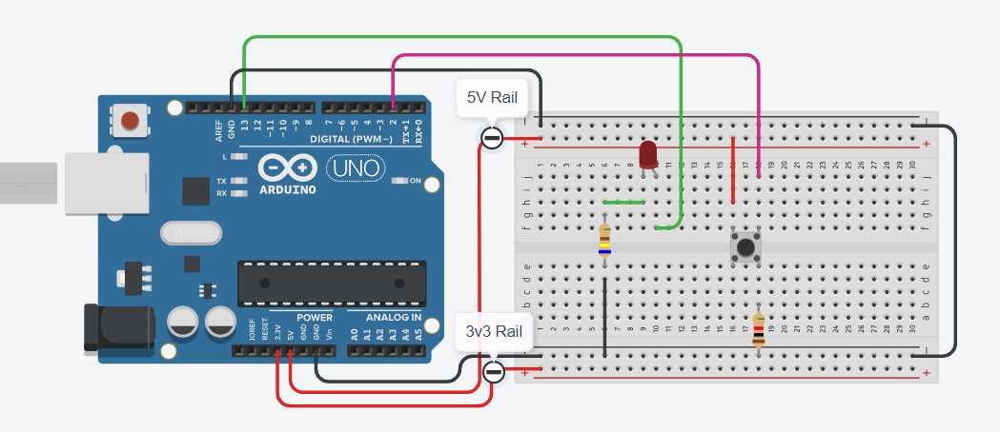

```cpp
/**
 * Demo Number 2
 * 
 * SUMMARY TEXT
 * 
 * Name: 	 YOUR NAME
 *
 * Year: 	 2024
 * Semester: 2
 *
 * Components:
 * - Arduino Uno R3			UNO_1
 * - Breadboard				BB_1
 * - LED [Red]				LED_R_1
 * - Resistor [640Ω]		RES_1
 * - Pushbutton Switch		PUSH_1
 */

// Macros & Constants
#define YOUR_NAME	"Adrian"
#define LED_RED_1	13
#define PB_1		2

// Variables
int count = 0;
int buttonState = LOW;

// Setting Up
void setup()
{
  Serial.begin(9600);
  pinMode(LED_RED_1, OUTPUT);
  pinMode(PB_1, INPUT);
  Serial.println("Starting...");
}

// Main Loop
void loop()
{
  buttonState = digitalRead(PB_1);
  Serial.print(buttonState);
  if (buttonState == HIGH) {
  	digitalWrite(LED_RED_1, HIGH);
  	delay(2000); // Wait for 1000 millisecond(s)
  	digitalWrite(LED_RED_1, LOW);
  }
}
```