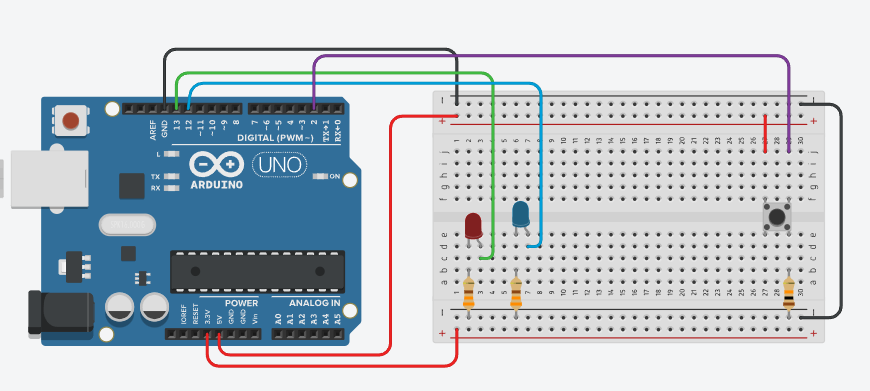

# Non-Blocking Flasher

## Components
| Name         | Quantity | Component      |
| ------------ | -------- | -------------- |
| Uno_R3_1     | 1        | Arduino Uno R3 |
| RED_LED_1    | 1        | Red LED        |
| RES_1, RES_2 | 2        | 330 Ω Resistor |
| PB_1         | 1        | Pushbutton     |
| RES_3        | 1        | 10 kΩ Resistor |
| BLUE_LED_1   | 1        | Blue LED       |

## Circuit



## Code

```cpp
#define RED_LED_1		13
#define BLUE_LED_1		12
#define PB_1			 2
#define PERIOD		  1000

int currentTime = 0;
int previousTime = 0;
int timeDiff = 0;
int ledState = LOW;
int buttonState = LOW;

void setup()
{
  Serial.begin(9600);
  pinMode(LED_BUILTIN, OUTPUT);
  pinMode(PB_1, INPUT);
  digitalWrite(RED_LED_1, ledState);
}

void loop()
{
  currentTime = millis();
  
  timeDiff = currentTime - previousTime;
  if (timeDiff > 1000){
    Serial.println(ledState);
    // ledState = ledState == LOW ? HIGH : LOW;
    ledState = !ledState;
    digitalWrite(RED_LED_1, ledState);
    previousTime = currentTime;
  }
  
  buttonState = digitalRead(PB_1);
  if (buttonState == HIGH) {
    digitalWrite(BLUE_LED_1, HIGH);
  } else {
    digitalWrite(BLUE_LED_1, LOW); 
  }
}
```