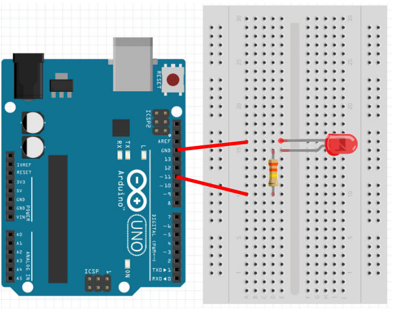

# Introducing C/C++ for IoT

[S02-Intro-to-C-Part-09.md](S02-Intro-to-C-Part-09.md) | [S02-Intro-to-C-Part-11.md](S02-Intro-to-C-Part-11.md)


# Digital Output  
  

> Hint:
> 
> Ideally, you should have completed ***Basics of C++ 
> (Intro to C, Parts [01](S02-Intro-to-C-Part-01.md) to [09](S02-Intro-to-C-Part-09.md)) before
> starting on this section of the course.
> 
> If you have not, you can still continue, but refer back to the **Basics of C++** tutorial if you
> encounter code that you do not understand.  

  
## Blink  
  
> Hint:
>  
> There are at least two ways to "simulate" an Arduino.
> 
> - TinkerCAD
> - Wokwi
>  
> Not all the exercises and lessons will be able to be completed using a simulator, but it gives you a head start.
>
> We use TinkerCAD as a starting simulator, at NMTAFE.
  
We can control any of the Arduino GPIO (General Purpose Input Output) pins using the `digitalWrite` command.  

Here's an example...  
  
```cpp
void setup() {  
  pinMode(13, OUTPUT);
}  
  
void loop() {  
    digitalWrite(13, HIGH);  
    delay(1000);  
    digitalWrite(13, LOW);  
    delay(1000);
}  
```  
  
`pinMode(13, OUTPUT)`
- By default, all the pins starts in the `INPUT` mode, this sets the mode of pin 13 to `OUTPUT`.  
- We only need to do this once, so we'll put this line in `setup`.  
  
`digitalWrite(13, HIGH)`
- This sets pin 13 to `HIGH`.  
- `HIGH` means `5V` on the Arduino UNO.  
- We are using pin 13 as it is a little special, it has a built-in LED connected to it on the Arduino board.  
- When we set pin 13 to `HIGH`, the LED will light up.  
  
`delay(1000)`
- This makes the Arduino wait for 1000ms (1 second).  
  
`digitalWrite(13, LOW)`
- This sets pin 13 to `LOW`.  
- `LOW` means `0V`.  
- When we set pin 13 to `LOW`, the LED will turn off.  
  
Upload the code to your Arduino. You should see an LED start to blink on your Arduino board. 

Try changing the duration of the delay and see what happens.  
  
> Note:
>  
> You can read more about `pinMode` and `digitalWrite` in the
> <a href="https://www.arduino.cc/reference/en/">Arduino documentation</a>.  

  
## Blink (External LED)  
  
Connect an external LED to your Arduino as follows...  
  
  
  
For the resistor, any value from 300 ohms to 2000 ohms should do fine.  
Pay attention to the length of the LED's legs; the short leg should be connected to **GND** while the long legs are connected to pin `11`.  
If you do not wish to use pin 11, you can also use any of the other pins from 2 to 13.  
  
Modify your earlier code to use pin 11 instead...  
  
```cpp
void setup() {  
  pinMode(11, OUTPUT);
  }  
  
void loop() {  
  digitalWrite(11, HIGH);  
  delay(1000);  
  digitalWrite(11, LOW);  
  delay(1000);
  }  
```  
  
Upload your code. If your wiring and code is correct, you should now see the external LED blinking.  
  
