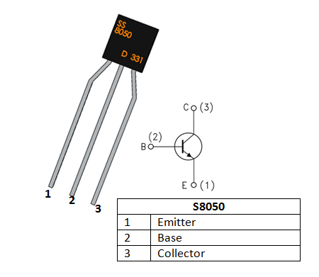
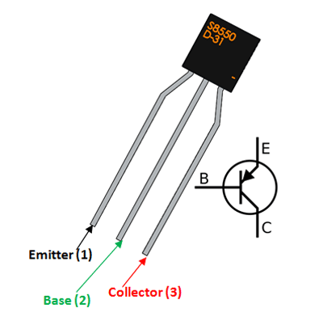

# Overview

In this session you will be challenged to work with the ESP32 and its sleep modes.

> **Important:** Make sure you document your code, and add references to any research that was interesting or useful as part of the opening comments to your code.
>  
>  The code and references may prove very useful for a future assessment item.

## Version Controlling Your Code

Make sure you have followed the steps for Session 03 Exercises and have your code version controlled.

# Research

Complete research into each of the following:

- Investigate how to have the ESP-32 *subscribe* to an MQTT topic.
  
- Investigate how to have the ESP-32 *receive* commands via the MQTT topic.
  
- Investigate how to have the ESP-32 *decode* the commands sent to it via MQTT.
  
- Investigate how to change the state of an actuator (e.g. LED, etc) when it receives the command.

Use MQTTX as the client to send data to the ESP-32.

# Challenge


> This challenge is NOT simple. Make sure you have covered the tutorials provided BEFORE attempting this.

In this challenge you will be investigating and implementing the ability to control an IoT device via MQTT messaging.

All challenges are in C/C++ unless indicated otherwise.
## Circuit

Create a circuit with 3 LEDs (1 each Red, Green and Blue) and 3 resistors (220Ω or 330Ω) and an ESP-32.

Connect each LED to one resistor and to one of pins 25, 26 and 27. Connect the other side of the resistor to the GROUND.

[CIRCUIT TO GO HERE]

## Implement

Putting all the above together, you will now:

- Send commands via MQTTX to the ESP-32.
- The topic must be `led/control` for the commands.
- The command structure must be:
```json
{
	"id":"ESP32-NN-XX",
	"led":"COLOUR",
	"on":"0"|"1"
}
```

- Replace NN with the desk number you are working at
- Replace XX with AA, AB,... ZA,... ZZ, etc. for each ESP-32 you are working with.
- The `COLOUR` is `red`, `green`, `blue` or `all`.
- The key `on` has two options, 1 or 0 (shown as 1|0 in the example), where `1` for turning the LED on, and `0` for turning it off.
- **ALL** LEDs must be **OFF** at power-up.

### Testing  

To test use the following conditions:

| Command                                                                         | Red | Green | Blue | Notes                             |
| ------------------------------------------------------------------------------- | --- | ----- | ---- | --------------------------------- |
| {<br>  "id": "ESP32-NN-XX",<br>  "led": "red",<br>  "on": "1"<br>}              | ON  | OFF   | OFF  | Red goes ON                       |
| {<br>  "id": "ESP32-NN-XX",<br>  "led": "green",<br>  "on": "1"<br>}            | ON  | ON    | OFF  | Red stays on, Green turns on      |
| {<br>  "id": "ESP32-NN-XX",<br>  "led": "amber",<br>  "on": "1"<br>}            | ON  | ON    | OFF  | No LEDs change state              |
| {<br>  "id": "ESP32-NN-XX",<br>  "led": "green",<br>  "on": "0"<br>}            | ON  | OFF   | OFF  | Red LED stays on, Green turns off |
| {<br>  "id": "ESP32-NN-XX",<br>  "led": "red",<br>  "on": "0"<br>}              | OGG | OFF   | OFF  | Red LED is off, others no change  |
| {<br>  "id": "ESP32-NN-XX",<br>  "led": "all",<br>  "on": "1"<br>}              | ON  | ON    | ON   | All LEDs turn on                  |
| {<br>  "id": "ESP32-NN-XX",<br>  "led": "all",<br>  "on": "0"<br>} | OFF | OFF   | OFF  | All LEDs turn off                 |


# Exercises

Follow the Tutorials listed below from the FreeNove Super Starter Kit (The tutorial file is linked here: [PDF Link](../assets/C_Tutorial.pdf) and was published 2025-02-25).

- Chapter 6 Buzzer
  - Doorbell
  - Alerter
  - Alerter (with timer)

- Chapter 3 LED Bar
  - Flowing Light 

### NPN Transistor



- https://youtu.be/w8-pq5bYbQM?si=HN9uI54GAZUWCVNr
- https://components101.com/transistors/s8050-transistor-pinout-equivalent-datasheet


<iframe width="560" height="315" src="https://www.youtube.com/embed/w8-pq5bYbQM?si=2DNlDNwlQh_o4bUP" title="YouTube video player" frameborder="0" allow="accelerometer; autoplay; clipboard-write; encrypted-media; gyroscope; picture-in-picture; web-share" referrerpolicy="strict-origin-when-cross-origin" allowfullscreen></iframe>


### PNP Transistor




- https://components101.com/transistors/s8850-pinout-equivalent-datasheet


[Back to Session 04...](ReadMe.md)
