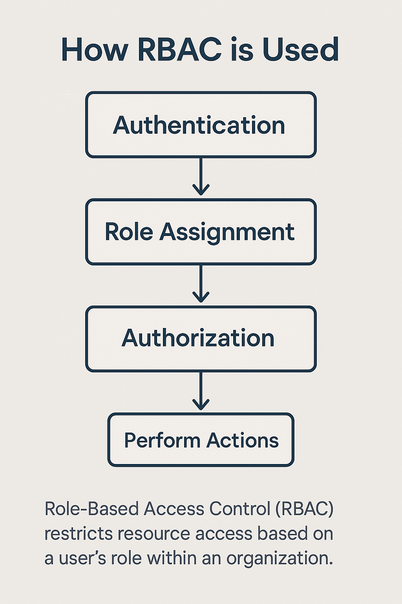

# Authentication and Authorisation

Intermediate RIoT / Session 11

Developed by Adrian Gould

---

```table-of-contents
title: # Contents
style: nestedList
minLevel: 0
maxLevel: 3
includeLinks: true
```

---

## Terminology

| Term           | Definition                                                                                                                                                                                                             |
|:---------------|:-----------------------------------------------------------------------------------------------------------------------------------------------------------------------------------------------------------------------|
| Authentication | Authentication is the process of verifying the identity of a user or process.                                                                                                                                          |
| Authorisation  | Authorisation is the process of determining whether a user or process has permission to access a specific resource or perform a specific action.                                                                       |
| Roles          | Roles are a set of permissions associated with a user or group that define what actions they can perform within a system.                                                                                              |
| Permissions    | Permissions are rules that define what actions a user or process can perform on specific resources within a system.                                                                                                    |
| Encryption     | Encryption is the process of converting data into a coded format to prevent unauthorized access.                                                                                                                       |
| Hashing        | Hashing is the process of converting data into a fixed-size string of characters, which is typically a hash code, used for secure data storage and verification.                                                       |
| TLS            | TLS stands for Transport Layer Security, which is a cryptographic protocol designed to provide secure communication over a computer network.                                                                           |
| SSL            | SSL stands for Secure Sockets Layer, which is a standard security protocol for establishing encrypted links between a web server and a browser in an online communication.                                             |
| DDoS           | DDoS stands for Distributed Denial of Service, which is a type of cyber attack where multiple compromised systems attack a single target, causing a denial of service for users of the targeted system.                |
| SQL Injection  | SQL Injection is a type of attack that involves inserting malicious SQL code into a query to manipulate the database and gain unauthorized access to data.                                                             |
| CORS           | CORS stands for Cross-Origin Resource Sharing, which is a security feature that allows or restricts resources on a web page to be requested from another domain outside the domain from which the resource originated. |
| Token          | A Token is a piece of data that is used to authenticate a user or process and provide access to a system or resource.                                                                                                  |
| OAuth & OAuth2 | OAuth stands for Open Authorization, which is a protocol for token-based authentication and authorization on the Internet; OAuth2 is the second version with improved security features.                               |
| 2FA            | 2FA stands for Two-Factor Authentication, which is a security process that requires two different forms of identification to access an account or system.                                                              |

## Authentication

Authentication is the act of validating that users are whom they claim to be. This is the first step in any security
process.

Complete an authentication process with:

- Passwords. Usernames and passwords are the most common authentication factors. If a user enters the correct data, the
system assumes the identity is valid and grants access.
- One-time pins. Grant access for only one session or transaction.
- Authentication apps. Generate security codes via an outside party that grants access.
- Biometrics. A user presents a fingerprint or eye scan to gain access to the system.

In some instances, systems require the successful verification of more than one factor before granting access. This
multi-factor authentication (MFA) requirement is often deployed to increase security beyond what passwords alone can
provide.

> Authentication vs. Authorization | Okta. (2024). Okta.com. https://www.okta.com/en-au/identity-101/authentication-vs-authorization/

## Authorisation

Authorization in system security is the process of giving the user permission to access a specific resource or function. This term is often used interchangeably with access control or client privilege.

Giving someone permission to download a particular file on a server or providing individual users with administrative access to an application are good examples of authorization.

In secure environments, authorization must always follow authentication. Users should first prove that their identities are genuine before an organization’s administrators grant them access to the requested resources.


> Authentication vs. Authorization | Okta. (2024). Okta.com. https://www.okta.com/en-au/identity-101/authentication-vs-authorization/

## Authentication and Authorisation Relationship

Authorisation cannot happen without Authentication first occurring.

- Authentication is the equivalent to showing your driver's license to enter a bank.
- Authorisation is the equivalent to being given permission to go to the vault and open your particular safe.

## Readings

Make sure you go over these articles / video resources.


> Auth0. (2025). Authentication vs. Authorization. Auth0 Docs. https://auth0.com/docs/get-started/identity-fundamentals/authentication-and-authorization
> 
> Authentication vs Authorization: Key Differences | Fortinet. (2025). Fortinet. https://www.fortinet.com/resources/cyberglossary/authentication-vs-authorization
> 
> McCarthy, M. (2025, June 25). Difference between RBAC vs. ABAC vs. ACL vs. PBAC vs. DAC. Strongdm.com; StrongDM, Inc. https://www.strongdm.com/blog/rbac-vs-abac
>


## Summary of RBAC workflow

> Created using Microsoft Co-Pilot



Role-Based Access Control (RBAC) is a method of regulating access to computer systems or resources based on the roles of individual users within an organization. Instead of assigning permissions directly to users, RBAC assigns permissions to roles, and users are assigned to roles based on their responsibilities.

Key Steps in RBAC Workflow:

- **Authentication**: The user logs in and their identity is verified (e.g., via username/password, biometrics).
- **Role Assignment**: Once authenticated, the system determines the user's role(s) (e.g., Admin, Editor, Viewer).
- **Authorization**: Based on the assigned role, the system checks what actions the user is permitted to perform.
- **Action Execution**: If authorized, the user can perform the requested action (e.g., read, write, delete).
- **Audit Logging**: Actions are logged for security and compliance purposes.


# END

Next up - [LINK TEXT](#)
