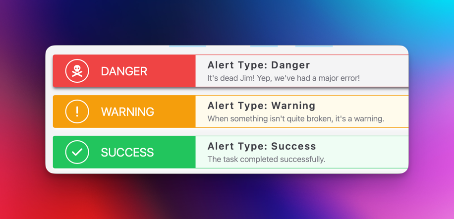

# Python, FastAPI and Templating

## Intermediate RIoT

### Session 10

Developed by Adrian Gould

---

```table-of-contents
title: # Contents
style: nestedList
minLevel: 0
maxLevel: 3
includeLinks: true
```

---

# Resources Needed

- Python 3.10+ (with Pip)
- PyCharm Professional 2024.2+ or other editor
- Node.js 18+ (with NPM)
- Internet Access
- GitHub (or equivalent) account

# Long Tutorial

This tutorial is long because it contains large extracts of code.

We have attempted to make it easy to follow, but also provide a base template for you to use when a Python FastAPI site and API may be required.


## Setting Up

We will do this manually, then open PyCharm for development.

Open terminal with the Bash CLI.

> **Note:**
> 
> If you need to set up Bash and aliases then please refer to:
> 
> - Adding Bash to Windows Terminal [link]
> - Aliases to simplify your work with Bash [link]


Ensure you are in your Source/Repos folder.

Create project folder, and change into it:

```shell
mkdir xxx-fastapi-templating
cd xxx-fastapi-templating
```

> **Remember:** `xxx` is replaced by your initials!

Create python virtual environment, and activate it:

```bash
python -m venv .venv
source ./venv/Scripts/activate
```

> **Mac/Linux Users:** 
> 
> You will need to replace `Scripts` with `.bin`...
> 
> `source ./venv/Scripts/activate`


Create base files & folders:

```bash
mkdir templates static src 
touch ReadMe.md .gitignore src/source.css
touch {src,templates,static}/.gitignore
```

Initialise version control...

```bash
git init .
git add src templates static
git add ReadMe.md .gitignore
git status
```

Use the `git status` command to check that the following are new files:

```text
new file:   .gitignore
new file:   ReadMe.md
new file:   src/.gitignore
new file:   src/source.css
new file:   static/.gitignore
new file:   templates/.gitignore
```

# PyCharm, Plugins and The Project

Open PyCharm professional and then use:
- Menu->File->Open 
to open the `xxx-fastapi-templating` folder as a new
project.

## Adding Plugins

Once the project is open, Use <kbd>CTRL</kbd>+<kbd>ALT</kbd>+<kbd>S</kbd> to open the settings (<kbd>
CMD</kbd>+<kbd>,</kbd> on MacOS).

Locate the Plugins section on the left side of the dialog.

In the Marketplace tab, locate and install the following plugins:

- .ignore
- Rainbow Brackets
- .env
- Key Promoter X
- CSV Editor
- Conventional Commit
- Pydantic
- Python Security

You will need to restart you PyCharm Professional IDE.

## Update the Git Ignore file

Now we need to update the `.gitignore` file.

Use the following steps:

- click on the `.gitignore` file in the root folder.
- Menu -> File -> New -> `.ignore` -> `.gitignore`

Add the following templates:

- Backup
- JetBrains+all
- JetBrains+iml
- Linux
- MacOS
- Windows
- Python
- VirtualEnv
- VisualStudioCode
- esp-idf
- Node

We suggest generating without duplicates and optionally without comments and empty lines.

Update the stashed files in git (including your PyCharm settings):

```shell
git add .gitignore .idea

git status
```

You should now see these listed as new files:

```text
.gitignore
.idea/.gitignore
.idea/inspectionProfiles/profiles_settings.xml
.idea/misc.xml
.idea/modules.xml
.idea/vcs.xml
.idea/xxx-fastapi-templating.iml
ReadMe.md
src/.gitignore
src/source.css
static/.gitignore
templates/.gitignore
```

Now commit these files:

```bash
git commit -m "init: Set Up Project"
```

# Set Up FastAPI & Jinja2

Install FastAPI and Jinja2 using:

```shell
pip install "fastapi[standard]" jinja2
```

Create a `requirements.txt` file using:

```shell
pip freeze > requirements.txt
```

# Set Up Tailwind CSS & FontAwesome

Seeing as we already have encountered TailwindCSS we may as well also include it in this project.

We will also add Font Awesome, a brilliant web icon collection providing `32,000` icons of which over `2,500` are free to use.

```shell
npm install tailwindcss
```

Initialize the TailwindCSS configuration file:

```
./node_modules/.bin/tailwindcss init
```

If you want to make this easier for the future you could add an alias to the command.

See https://help.screencraft.net.au/hc/2680392001/66/add-bash-command-line-aliases-for-git for more details.

Open the `tailwind.config.js` file (it will be in the root of the project) and update it so it contains:

```js
/**
 * Tailwind Configuration File
 *
 * Filename:        tailwind.config.js
 * Location:        /
 * Project:         SaaS-Vanilla-MVC
 * Date Created:    20/08/2024
 *
 * Author:          Your Name
 */

/** @type {import('tailwindcss').Config} */
module.exports = {
    content: [
        "static/**/*.{js,html,py}",
        "templates/**/*.{js,html,py}",
        "app.py",
    ],
    theme: {
        extend: {},
    },
    plugins: [],
}
```

Open the `src/source.css` file and add:

```css
@tailwind base;
@tailwind components;
@tailwind utilities;
```

### Font Awesome

Now we need to download [FontAwesome](https://FontAwesome.com).

We have provided a minimal installation with all the web fonts and the required CSS files for the free version of
FontAwesome 6.0.0.

If you want to grab the latest then head to the [FontAwesome.com](https://FontAwesome.com) website and download the web
version from there.

**OR** you may download our minimal installation file from here:

- [FontAwesome-6-Minimal.7z](../assets/FontAwesome-6-Minimal.7z)
  or
- [FontAwesome-6-Minimal.zip](../assets/FontAwesome-6-Minimal.zip)

Extract the contents and copy the `webfonts` and the `css` folders into the `static` folder in your project.

We will add these to our base template later...

### Watching the files...

Open a new Bash CLI.

Presuming you are in the `Source/Repos` folder we now change into the project folder, and start the Tailwind build &
watch:

```bash
cd xxx-fastapi-templating
tailwind -i src/source.css -o static/css/site.css --watch
```

# Creating A Home Page

Create a Python `app.py` file:

```shell
touch app.py
```

Now edit it in PyCharm...

Add the following:

```python
from fastapi import FastAPI, Request, HTTPException

app = FastAPI(title="FastAPI Templating")

@app.get("/")
async def home(request: Request):
    return "{'greeting':'Hello World'}"
```

## Start the (FastAPI) Engines...

```shell
fastapi dev app.py
```

### Visit your new little application at:

```text
http://127.0.0.1:8000
```

You should see a very simple "Hello World" message (which happens to be in JSON format).

## Add Static file & Template Pages & Components Folders

Open a new CLI and make sure you have `cd`-ed into the project folder, and then activated Python:

```shell
cd xxx-fastapi-templating
source ./venv/Scripts/activate
```


Run the following commands to create `.gitignore` files in new `js`, `img`, and `files` folders.

```shell
mkdir -P static/{img,files,js} templates/{pages,components}
touch static/{img,files,js}/.gitignore
touch templates/{pages,components}/.gitignore
```

## Commit the work So Far

```shell
git add .
git commit -m "feat(start): Start of the application

- Add static/js folder
- Add static/img folder
- Add static/files folder
- Add templates/pages folder
- Add templates/components folder
- Create simple application
"
```

> **Note** the multi-line comment is entered on the command line by only using the `"` close quotes after
> the final line of the comment.
>
> A neat little trick when working at the CLI.

# Adding an HTML Template

We are, at the moment, more interested in creating a small website, so here goes.

Use the command line to create empty files for number of pages and other files.

```shell
touch templates/pages/home.html
touch templates/pages/about.html
touch templates/base.html
touch templates/components/{header,navigation,footer}.html
touch static/js/menu.js
```

We are getting the HTML files ready (even if they are blank) for adding their content.

Open the base page and add the following:

```html
<!DOCTYPE html>
<html lang="en">
<head>
    <meta charset="UTF-8">
    <title> DEFAULT TITLE </title>

    <!-- TailwindCSS include -->
    <link href="{{ url_for('static', path='css/site.css') }}" rel="stylesheet">

    <!-- FontAwesome include -->
    <link href="{{ url_for('static', path='css/all.css') }}" rel="stylesheet">

</head>
<body>

<div class="flex flex-col w-full min-h-screen bg-zinc-100 ">

    

    <main class="container grow h-full mx-auto p-8 flex flex-col ">
        

        
        ...
        
    </main>

    

</div>
<script src="{{ url_for('static',path='js/menu.js') }}" defer></script>
</body>
</html>
```

Important items:

- ` DEFAULT_CONTENT `

This denotes a Jinja2 template "content block" that may be replaced in the pages that use the template.

To replace the default content we use ` NEW CONTENT ` in the page that is
extending the base (or other) template.

- ``

This statement tells the Jinja2 templating engine to include the file contained at the
location `FILE_PATH_AND_NAME`.

The path is relative to the application's location.

- `{{ url_for('LOCATION_ALIAS',path='FILE_PATH_AND_NAME') }}`

The Jinja2 templating engine will generate the full relative path name based on the `LOCATION_ALIAS` to
the file `FILE_PATH_AND_NAME` that is contained on the `LOCATION_ALIAS`.

OK, so we had better update the `app.py` to start off with.

## Update `app.py` to add the static locations...

We will need a few new includes to start of with:

```python
from pathlib import Path

from fastapi import FastAPI, Request, HTTPException
from fastapi.responses import HTMLResponse
from fastapi.staticfiles import StaticFiles
from fastapi.templating import Jinja2Templates
```

This adds the various static file and template handling methods, plus the HTML Response class.

```python
app = FastAPI(title="FastAPI Templating")
```

The "app" line has not changed.

```python
BASE_PATH = Path(__file__).resolve().parent
```

We grab the application's home folder location, for debugging purposes.

```python
app.mount("/static", StaticFiles(directory="static"), name="static")

TEMPLATES = Jinja2Templates(directory="templates")
```

Here we are creating the static location alias that is used in the templates.

We could add these aliases specific to each of the folders if we wanted.

In fact, we will do that.

```python
app.mount("/css", StaticFiles(directory="static/css"), name="css")
app.mount("/js", StaticFiles(directory="static/js"), name="js")
```

This can be useful in reducing the code in the templates if needed.

```python
print(BASE_PATH)
```

This is just a debugging line, and does not affect the application's output.

Now we update the "home" route to return the home page...

```python
@app.get("/", response_class=HTMLResponse)
async def home(request: Request):
    return TEMPLATES.TemplateResponse(
        request=request, name="pages/home.html"
    )
```

### Preview page

How about refreshing the http://127.0.0.1:8000 page and seeing what you get?

Hopefully no errors...

## Create the Home Page Content

Now open the `templates/pages/home.html` file and edit.

Add the following:

```html

```

This tells the Jinja2 engine that this content is based on (extends) the `base.html` template page.

```html
Home
```

We now tell the Jinja engine that the "title" of the page is `Home` and it will insert this into the
template's "title" block replacing the default title.

We then tell Jinja2 that we want to have an empty secondary navigation section.

This is one way of us easily inserting an additional navigation bar if we needed to.

```html

```

One of the beautiful parts of Jinja2 is that you can define the replacement content in any order you wish.

So, as the footer is short, we will add it after the extra content navigation.

```html
<!-- Footer of Page -->

<p class="text-zinc-500 text-left px-2 font-medium uppercase title-font mb-4 border-b border-zinc-500 w-full">
    Home Page
</p>

```

Finally, we add the main content.

We are showing just some placeholder items at the moment.

```html

<section class="container mx-auto border grow h-full shadow-md p-4 rounded space-y-2">
    <h2 class="bg-zinc-500 text-zinc-100 p-4 mb-4 -mx-4 -mt-4 rounded-t">Home Page</h2>
    <p>MAIN CONTENT</p>

    <ul class="list-disc list-inside">
        <li>List Item</li>
        <li>List Item</li>
        <li>List Item</li>
        <li>List Item</li>
        <li>List Item</li>
    </ul>

</section>

```

We should see a bit more from the page if you now refresh the browser.

## Create the components

We need header, footer and navigation components to begin with.

### `header.html` component

Let's get the Header component created.

Open the `templates/components/header.html` file and add:

```html

<header class="bg-zinc-900 w-full">

    

</header>
```

### `footer.html` component

Next the footer component...

We have a fairly large chunk of code for this footer. it is split into two parts:

- a footer navigation/links section
- a copyright / other info section

The footer/navigation section is split into lines that are related to each other, and each
item is spaced out based on a 'grid'.

The copyright section is a simple set of paragraphs.

```html
<!-- Page Footer -->
<!-- based on https://www.creative-tim.com/twcomponents/component/tailwind-css-footer-1-->
<footer class="w-full text-zinc-700 bg-zinc-300 body-font text-sm">
    <div class="px-16 py-6 flex flex-col flex-wrap flex-grow w-full bg-zinc-200 ">

        <nav class="grid grid-cols-4 md:grid-cols-8 ">
            <h2 class="text-left mx-2 font-medium tracking-widest text-zinc-500 uppercase title-font">About</h2>
            <a href="{{ url_for('home') }}"
               class="text-left mx-2 text-zinc-400 cursor-pointer hover:text-zinc-600">Company</a>
            <a href="{{ url_for('home') }}"
               class="text-left mx-2 text-zinc-400 cursor-pointer hover:text-zinc-600">Careers</a>
            <a href="{{ url_for('home') }}"
               class="text-left mx-2 text-zinc-400 cursor-pointer hover:text-zinc-600">Blog</a>
        </nav>

        <nav class="grid grid-cols-4 md:grid-cols-8 pb-4">
            <h2 class="text-left mx-2 text-sm font-medium tracking-widest text-zinc-500 uppercase title-font">
                Support</h2>
            <a href="{{ url_for('home') }}"
               class="text-left mx-2 text-zinc-400 cursor-pointer hover:text-zinc-600">Contact Support</a>
            <a href="{{ url_for('home') }}"
               class="text-left mx-2 text-zinc-400 cursor-pointer hover:text-zinc-600">Help Resources</a>
            <a href="{{ url_for('home') }}"
               class="text-left mx-2 text-zinc-400 cursor-pointer hover:text-zinc-600">Release Updates</a>
        </nav>
    </div>
    <div class="w-full px-16 py-4 mx-auto mt-4">
        <p class="text-xs text-zinc-500 capitalize">
            © Copyright 2024 YOUR NAME. All rights reserved
        </p>
    </div>
</footer>
```

### `navigation.html` component

Finally, the navigation, which is quite a bit more complex.

Open the `templates/components/footer.html` file and add:

```html
<!-- Layout based on https://www.creative-tim.com/twcomponents/u/denver-edwards -->
<nav class="border border-zinc-300 py-2.5 bg-zinc-200 shadow-md shadow-zinc-900/50">
    <div class="container flex flex-wrap justify-between items-center mx-auto">
        <!-- Brand -->
        <a href="{{ url_for('home') }}" class="flex items-center">
            <h1 class="self-center text-xl font-semibold whitespace-nowrap flex flex-row-reverse">
                <span class="pl-2">
                    FastAPI
                </span>
                <span>
                    <i class="fa-brands fa-python text-zinc-500"></i>
                    <i class="fa-solid fa-truck-fast text-zinc-500"></i>
                </span>
            </h1>
        </a>

        <!-- Mobile/Responsive Navigation button -->
        <div class="flex items-center">
            <button
                    id="menu-toggle"
                    type="button"
                    class="inline-flex items-center p-2 ml-3 rounded-md text-sm text-zinc-500
                           hover:text-red-500 hover:bg-zinc-100
                           focus:outline-none focus:ring-2 focus:ring-zinc-200
                           md:hidden"
            >
                <span class="sr-only">Open main menu</span>
                <!-- Hamburger icon -->
                <svg class="h-6 w-6 " fill="none" viewBox="0 0 24 24" stroke="currentColor">
                    <path
                            stroke-linecap="round"
                            stroke-linejoin="round"
                            stroke-width="2"
                            d="M4 6h16M4 12h16m-7 6h7"
                    />
                </svg>
            </button>
        </div>

        <!-- Actual Navigation -->
        <div class="w-full md:block md:w-auto hidden"
             id="mobile-menu">
            <ul class="flex flex-col mt-4 md:flex-row md:space-x-8 md:mt-0 md:text-sm md:font-medium">
                <li>
                    <a href="{{ url_for('home') }}"
                       class="block py-2 pr-4 pl-3 md:p-0
                              text-zinc-700 hover:text-red-700
                              hover:bg-zinc-50 md:hover:bg-transparent
                              border-b border-zinc-100 md:border-0"
                       aria-current="page">
                        Home
                    </a>
                </li>
                <li>
                    <a href="{{ url_for('home') }}"
                       class="block py-2 pr-4 pl-3 md:p-0
                              text-zinc-700 hover:text-red-700
                              hover:bg-zinc-50 md:hover:bg-transparent
                              border-b border-zinc-100 md:border-0">
                        About
                    </a>
                </li>
                <li>
                    <a href="{{ url_for('home') }}"
                       class="block py-2 pr-4 pl-3 md:p-0
                              text-zinc-700 hover:text-red-700
                              hover:bg-zinc-50 md:hover:bg-transparent
                              border-b border-zinc-100 md:border-0">
                        Link
                    </a>
                </li>
                <li>
                    <a href="{{ url_for('home') }}"
                       class="block py-2 pr-4 pl-3 md:p-0
                              text-zinc-700 hover:text-red-700
                              hover:bg-zinc-50 md:hover:bg-transparent
                              border-b border-zinc-100 md:border-0">
                        Link
                    </a>
                </li>
                <li>
                    <a href="{{ url_for('home') }}"
                       class="block py-2 pr-4 pl-3 md:p-0
                              text-zinc-700 hover:text-red-700
                              hover:bg-zinc-50 md:hover:bg-transparent
                              border-b border-zinc-100 md:border-0">
                        Link
                    </a>
                </li>
            </ul>
        </div>

    </div>
</nav>

```

Once these are completed then refreshing the browser should show something similar to:


## About Page

Open the `about.html` file and add the following code.

We are making this easy by providing the whole block of code for you in one go.

```html


About


<h2 class="mx-4 text-3xl text-zinc-700 text-left font-medium uppercase title-font">
    <i class="fa-solid fa-info-circle text-zinc-500"></i>
    About the App
</h2>



<section class="container mx-auto border grow h-full shadow-md p-4 pb-8 rounded space-y-2">
    <h2 class="text-xl text-zinc-50 bg-zinc-600 p-4 pb-6 mb-6 -mx-4 -mt-4 rounded-t">
        The Team
    </h2>

    <div class="grid grid-cols-1 lg:grid-cols-2 xl:grid-cols-3 gap-8">
        <section class="border border-2 p-2 text-zinc-500 space-y-2">
            <header class="-mt-2 -mx-2 mb-4 flex space-x-2 bg-zinc-500 text-zinc-100  items-center">
                <h4 class="p-2 py-3 text-xl font-medium w-2/3">
                    YOUR NAME
                </h4>
                <p class="px-2 text-sm text-right grow">
                    Lead Developer
                </p>
            </header>

            <p>More details here</p>

        </section>

        <section class="border border-2 p-2 text-zinc-500 space-y-2">
            <header class="-mt-2 -mx-2 mb-4 flex space-x-2 bg-zinc-500 text-zinc-100  items-center">
                <h4 class="p-2 py-3 text-xl font-medium w-2/3">
                    LECTURER'S NAME
                </h4>
                <p class="px-2 text-sm text-right grow">
                    Development Supervisor
                </p>
            </header>

            <p>More details here</p>

        </section>

        <section class="border border-2 p-2 text-zinc-500 space-y-2">
            <header class="-mt-2 -mx-2 mb-4 flex space-x-2 bg-zinc-500 text-zinc-100  items-center">
                <h4 class="p-2 py-3 text-xl font-medium w-2/3">
                    TEAM MEMBER NAME
                </h4>
                <p class="px-2 text-sm text-right grow">
                    Developer
                </p>
            </header>

            <p>More details here</p>

        </section>

    </div>
</section>

<section class="container mx-auto border grow h-full shadow-md p-4 pb-8 rounded space-y-2">
    <h2 class="text-xl text-zinc-50 bg-zinc-600 p-4 pb-6 mb-6 -mx-4 -mt-4 rounded-t">
        Technologies
    </h2>

    <div class="flex space-x-6 text-zinc-600">
        <p>
            <a href="#" class="hover:text-zinc-500 underline underline-offset-4">
                <i class="fa-brands fa-python pr-1"></i>
                Python
            </a>
        </p>
        <p>
            <a href="#" class="hover:text-zinc-500 underline underline-offset-4">
                <i class="fa-brands fa-python pr-1"></i>
                FastAPI
            </a>
        </p>
        <p>
            <a href="#" class="hover:text-zinc-500 underline underline-offset-4">
                <i class="fa-brands fa-python pr-1"></i>
                Jinja2
            </a>
        </p>
        <p>
            <a href="#" class="hover:text-zinc-500 underline underline-offset-4">
                <i class="fa-brands fa-css3 pr-1"></i>
                TailwindCSS
            </a>
        </p>
        <p>
            <a href="#" class="hover:text-zinc-500 underline underline-offset-4">
                <i class="fa-brands fa-font-awesome pr-1"></i>
                FontAwesome
            </a>
        </p>
    </div>

</section>


```

Update the HTML content using the following rules:

- YOUR NAME is replaced by your own name
- LECTURER'S NAME is replaced by your lecturer's name
- TEAM MEMBER NAME is replaced by the name of any other member of the class

## Useful Extras

Now we are providing some useful extras in the shape of a colour reference page, an alerts example page, and an alert
component.

We will provide the code for all three, but only explain the alert component.

Create the empty files using:

```bash
touch templates/components/alert-card.html
touch templates/pages/{colours,alerts}.html
```

### Update the Footer

In the footer file we are going to provide links to these two files.

Open `footer.html` and go to the end of the file.

Locate the lines:

```html
    </div>
<div class="w-full px-16 pt-4 pb-8 mx-auto space-y-1">
    <p class="text-xs text-zinc-500 capitalize">
        © Copyright 2024 YOUR NAME. All rights reserved
    </p>
</div>
```

And immediately before them, and inside the `</div>` and immediately after the `</nav>` before it, add:

```html

<nav class="grid grid-cols-4 md:grid-cols-8 ">
    <h2 class="text-left mx-2 font-medium tracking-widest text-zinc-500 uppercase title-font">App Support</h2>
    <a href="{{ url_for('colours') }}"
       class="text-left mx-2 text-zinc-400 cursor-pointer hover:text-zinc-600">Colours</a>
    <a href="{{ url_for('alerts') }}"
       class="text-left mx-2 text-zinc-400 cursor-pointer hover:text-zinc-600">Alerts</a>
    <a href="{{ url_for('home') }}"
       class="text-left mx-2 text-zinc-400 cursor-pointer hover:text-zinc-600">...</a>
    <a href="{{ url_for('home') }}"
       class="text-left mx-2 text-zinc-400 cursor-pointer hover:text-zinc-600">...</a>
</nav>
```

Now that is done, we can edit the alert-card, colours and alerts pages/components to add the code that is needed for
each of these.

### Alert Component

Open the `alert-car.html` file and add the following:

```html

```

This tells Jinja2 that the following is a "macro", which means it takes parameter values to be used in the following
HTML.

It is structured as "macro" followed by the "macro name" then the parameters in open and close parentheses (`(` and
`)`).

The parameters in this case is a single dictionary named 'status'.

The parts of the dictionary are:

- `url` which is the endpoint being visited, defaults to the `home` route.
- `name` is a name for the alert
- `bg` is the left hand section's background and border colour. It is also used in a very pale variant for the main alert background.
- `colour` is the base text colour
- `logo` is a Font Awesome icon name
- `heading` is the main text of the alert
- `details` contains any extra details that may be conveyed to the user.

Here are trimmed examples of a Danger, Warning and Success Alert.



The Danger alert may be generated using code similar to this in an HTML page:

```html
{{ alert_card.alert_card( status={
'name': 'DANGER',
'colour': 'zinc',
'bg': 'red',
'logo': 'skull-crossbones',
'url': 'home',
'heading': "Alert Type: Danger",
'details': "It's dead Jim! Yep, we've had a major error!",
}) }}
```

After the macro line, we then add the HTML to construct the alert.

We have designed this so it is reduces the repeated code, but at the disadvantage that we need a page with all the
colours for text, backgrounds, hovers and more to be defined somewhere else... that is the purpose of the colours
page...

Here we go with our actual alert card code:

```html

<section class="my-4">

    <a href="{{ url_for(status.url) }}"
       class="shadow shadow-md shadow-white hover:shadow-zinc-500
              transition ease-in-out duration-500 bg-{{status.bg}}-50
              grid grid-cols-10 items-center gap-0 space-x-0 space-y-0
              rounded border border-{{status.bg}}-500  ">

        <div class="col-span-2 min-h-16
                    py-2 px-6 bg-{{status.bg}}-500
                    text-2xl text-white
                    flex flex-row items-center ">
            <p class="border border-white border-2 rounded-full w-12 h-12 content-center text-center">
                <i class="fa fa-solid fa-{{status.logo}}"></i>
            </p>
            <p class="pl-6">{{ status.name }}</p>
        </div>

        <div class="col-span-8 text-{{status.colour}}-700 px-6 flex flex-col">
            <p class="tracking-widest text-xl font-semibold">{{ status.heading }}</p>
            <p class="font-light text-{{status.colour}}-500 ">{{ status.details }}</p>
        </div>
    </a>

</section>
```

Finally, we need to end the macro:

```html


```

That's it.

Now we get to add an example alerts page and route...

### Alerts Page (`pages/alerts.html`)

In the `app.py` file, we will add a new route and method to generate examples of alerts.

These alerts will be for:

- Danger
- Warning
- Success
- Question
- Information
- Primary (general)
- Secondary (general)
- Directive

You could probably come up with more types of alert if you wanted, such as Emergency, Not Found, PICNIC, and so on.

OK, let's add the following at the end of the `app.py` file:

```python
@app.get("/alerts", response_class=HTMLResponse)
async def alerts(request: Request):
    statuses = [
        {
            'name': 'DANGER', 'colour': 'zinc', 'bg': 'red',
            'logo': 'skull-crossbones', 'url': 'home',
            'heading': "Alert Type: Danger",
            'details': "It's dead Jim! Yep, we've had a major error!",
        },
        {
            'name': 'WARNING', 'colour': 'zinc', 'bg': 'amber',
            'logo': 'exclamation', 'url': 'home',
            'heading': "Alert Type: Warning",
            'details': "When something isn't quite broken, it's a warning.",
        },
        {
            'name': 'SUCCESS', 'colour': 'zinc', 'bg': 'green',
            'logo': 'check', 'url': 'home',
            'heading': "Alert Type: Success",
            'details': "The task completed successfully.",
        },
        {
            'name': 'QUESTION', 'colour': 'zinc', 'bg': 'teal',
            'logo': 'question', 'url': 'home',
            'heading': "Alert Type: Question",
            'details': "Want the user to answer a question, you may use this alert.",
        },
        {
            'name': 'INFO', 'colour': 'zinc', 'bg': 'sky',
            'logo': 'info', 'url': 'home',
            'heading': "Alert Type: Information",
            'details': "When you just want to tell the user something that is not an alert.",
        },
        {
            'name': 'PRIMARY', 'colour': 'zinc', 'bg': 'blue',
            'logo': 'thumbs-up', 'url': 'home',
            'heading': "Alert Type: Primary",
            'details': "A general primary alert message with details.",
        },
        {
            'name': 'DIRECTIVE', 'colour': 'zinc', 'bg': 'indigo',
            'logo': 'traffic-light', 'url': 'home',
            'heading': "Alert Type: Directive",
            'details': "When you need the user to do something, you could use this alert.",
        },
        {
            'name': 'SECONDARY', 'colour': 'zinc', 'bg': 'zinc',
            'logo': 'pencil', 'url': 'home',
            'heading': "Alert Type: Secondary",
            'details': "This is a general secondary alert and details.",
        },
    ]

    return TEMPLATES.TemplateResponse(
        request=request,
        name="pages/alerts.html",
        context={
            'user': [],
            'statuses': statuses
        }
    )
```

In the `alerts.html` file add:

```html





Alert Samples


<h2 class="mx-4 text-3xl text-zinc-700 text-left font-medium uppercase title-font">
    <i class="fa-solid fa-home text-zinc-500"></i>
    Alert Samples
</h2>



<section class="container mx-auto border grow h-full shadow-md p-4 pb-8 rounded space-y-2">
    <h2 class="text-xl text-zinc-50 bg-zinc-600 p-4 pb-6 mb-6 -mx-4 -mt-4 rounded-t">
        Alert! Alert!
    </h2>

    <p>
        The following are examples of the types of alerts you could create using he "alert-card" template macro.
    </p>
    <p>
        To see how it is used, check the <code class="bg-sky-200 text-sky-700 py-1 px-2">app.py</code> file and the
        <code class="bg-sky-200 text-sky-700 py-1 px-2">home</code> and
        <code class="bg-sky-200 text-sky-700 py-1 px-2">alerts</code> methods/routes.
    </p>

    <section>
        

        {{ alert_card.alert_card( status=status ) }}

        
    </section>


</section>


```

Now we go onto the colours page - which as we said will be the raw code for ease.

### Colours Page (`pages/colours.html`)

This is a bit of a monster... 

***There are almost 600 lines of HTML code...***

So get ready:

```html


 Colour Samples 


<header class="max-w-3xl mb-6 text-stone-500">
    <h1 class="block text-2xl font-bold text-black sm:text-3xl">
        Colour Samples
    </h1>
</header>



<div class="grid grid-cols-12 gap-4 text-2xl font-hover:text-2xl font-semi-bold font-mono">
    <p class="min-h-24 font-sans col-span-3 content-center text-center">Base Colours</p>
    <p class="min-h-24 text-black bg-hover:text-black bg-white content-center text-center">white</p>
    <p class="min-h-24 content-center text-center text-white  bg-black ">white</p>
    <p class="min-h-24 group-ite bg-black content-center text-center">black</p>
    <p class="min-h-24 group-ack bg-white content-center text-center">black</p>
    <p class="min-h-24 col-span-5"></p>

    <p class="min-h-24 row-span-2 font-sans bg-red-500 border border-red-500 text-white text-center content-center">
        <span class="display inline-block -rotate-90 ">RED</span>
    </p>
    <p class="min-h-24 text-black bg-hover:text-black bg-white g-red-50 content-center text-center">50</p>
    <p class="min-h-24 bg-red-100 hover:bg-red-100 border-red-100 content-center text-center">100</p>
    <p class="min-h-24 bg-red-200 hover:bg-red-200 border-red-200 content-center text-center">200</p>
    <p class="min-h-24 bg-red-300 hover:bg-red-300 border-red-300 content-center text-center">300</p>
    <p class="min-h-24 bg-red-400 hover:bg-red-400 border-red-400 content-center text-center">400</p>
    <p class="min-h-24 bg-red-500 hover:bg-red-500 border-red-500 content-center text-center text-white ">500</p>
    <p class="min-h-24 bg-red-600 hover:bg-red-600 border-red-600 content-center text-center text-white ">600</p>
    <p class="min-h-24 bg-red-700 hover:bg-red-700 border-red-700 content-center text-center text-white ">700</p>
    <p class="min-h-24 bg-red-800 hover:bg-red-800 border-red-800 content-center text-center text-white ">800</p>
    <p class="min-h-24 bg-red-900 hover:bg-red-900 border-red-900 content-center text-center text-white ">900</p>
    <p class="min-h-24 bg-red-950 hover:bg-red-950 border-red-950 content-center text-center text-white ">950</p>
    <p class="min-h-24 text-red-50 hover:text-red-50 content-center text-center bg-black ">50</p>
    <p class="min-h-24 text-red-100 hover:text-red-100 content-center text-center bg-black ">100</p>
    <p class="min-h-24 text-red-200 hover:text-red-200 content-center text-center bg-black ">200</p>
    <p class="min-h-24 text-red-300 hover:text-red-300 content-center text-center bg-black ">300</p>
    <p class="min-h-24 text-red-400 hover:text-red-400 content-center text-center bg-black ">400</p>
    <p class="min-h-24 text-red-500 hover:text-red-500 content-center text-center bg-black ">500</p>
    <p class="min-h-24 text-red-600 hover:text-red-600 content-center text-center">600</p>
    <p class="min-h-24 text-red-700 hover:text-red-700 content-center text-center">700</p>
    <p class="min-h-24 text-red-800 hover:text-red-800 content-center text-center">800</p>
    <p class="min-h-24 text-red-900 hover:text-red-900 content-center text-center">900</p>
    <p class="min-h-24 text-red-950 hover:text-red-950 content-center text-center">950</p>

    <p
            class="min-h-24 row-span-2 font-sans bg-orange-500 border border-orange-500 text-white text-center content-center">
        <span class="display inline-block -rotate-90 ">ORANGE</span>
    </p>
    <p class="min-h-24 bg-orange-50 hover:bg-orange-50 border-orange-50  content-center text-center">50</p>
    <p class="min-h-24 bg-orange-100 hover:bg-orange-100 border-orange-100 content-center text-center">100</p>
    <p class="min-h-24 bg-orange-200 hover:bg-orange-200 border-orange-200 content-center text-center">200</p>
    <p class="min-h-24 bg-orange-300 hover:bg-orange-300 border-orange-300 content-center text-center">300</p>
    <p class="min-h-24 bg-orange-400 hover:bg-orange-400 border-orange-400 content-center text-center">400</p>
    <p class="min-h-24 bg-orange-500 hover:bg-orange-500 border-orange-500 content-center text-center text-white ">
        500</p>
    <p class="min-h-24 bg-orange-600 hover:bg-orange-600 border-orange-600 content-center text-center text-white ">
        600</p>
    <p class="min-h-24 bg-orange-700 hover:bg-orange-700 border-orange-700 content-center text-center text-white ">
        700</p>
    <p class="min-h-24 bg-orange-800 hover:bg-orange-800 border-orange-800 content-center text-center text-white ">
        800</p>
    <p class="min-h-24 bg-orange-900 hover:bg-orange-900 border-orange-900 content-center text-center text-white ">
        900</p>
    <p class="min-h-24 bg-orange-950 hover:bg-orange-950 border-orange-950 content-center text-center text-white ">
        950</p>
    <p class="min-h-24 text-orange-50 hover:text-orange-50 content-center text-center bg-black ">50</p>
    <p class="min-h-24 text-orange-100 hover:text-orange-100 content-center text-center bg-black ">100</p>
    <p class="min-h-24 text-orange-200 hover:text-orange-200 content-center text-center bg-black ">200</p>
    <p class="min-h-24 text-orange-300 hover:text-orange-300 content-center text-center bg-black ">300</p>
    <p class="min-h-24 text-orange-400 hover:text-orange-400 content-center text-center bg-black ">400</p>
    <p class="min-h-24 text-orange-500 hover:text-orange-500 content-center text-center bg-black ">500</p>
    <p class="min-h-24 text-orange-600 hover:text-orange-600 content-center text-center">600</p>
    <p class="min-h-24 text-orange-700 hover:text-orange-700 content-center text-center">700</p>
    <p class="min-h-24 text-orange-800 hover:text-orange-800 content-center text-center">800</p>
    <p class="min-h-24 text-orange-900 hover:text-orange-900 content-center text-center">900</p>
    <p class="min-h-24 text-orange-950 hover:text-orange-950 content-center text-center">950</p>

    <p class="min-h-24 row-span-2 font-sans bg-amber-500 border border-amber-500 text-white text-center content-center">
        <span class="display inline-block -rotate-90 ">AMBER</span>
    </p>
    <p class="min-h-24 bg-amber-50 hover:bg-amber-50 border-amber-50 content-center text-center">50</p>
    <p class="min-h-24 bg-amber-100 hover:bg-amber-100 border-amber-100 content-center text-center">100</p>
    <p class="min-h-24 bg-amber-200 hover:bg-amber-200 border-amber-200 content-center text-center">200</p>
    <p class="min-h-24 bg-amber-300 hover:bg-amber-300 border-amber-300 content-center text-center">300</p>
    <p class="min-h-24 bg-amber-400 hover:bg-amber-400 border-amber-400 content-center text-center">400</p>
    <p class="min-h-24 bg-amber-500 hover:bg-amber-500 border-amber-500 content-center text-center text-white ">500</p>
    <p class="min-h-24 bg-amber-600 hover:bg-amber-600 border-amber-600 content-center text-center text-white ">600</p>
    <p class="min-h-24 bg-amber-700 hover:bg-amber-700 border-amber-700 content-center text-center text-white ">700</p>
    <p class="min-h-24 bg-amber-800 hover:bg-amber-800 border-amber-800 content-center text-center text-white ">800</p>
    <p class="min-h-24 bg-amber-900 hover:bg-amber-900 border-amber-900 content-center text-center text-white ">900</p>
    <p class="min-h-24 bg-amber-950 hover:bg-amber-950 border-amber-950 content-center text-center text-white ">950</p>
    <p class="min-h-24 text-amber-50 hover:text-amber-50 content-center text-center bg-black ">50</p>
    <p class="min-h-24 text-amber-100 hover:text-amber-100 content-center text-center bg-black ">100</p>
    <p class="min-h-24 text-amber-200 hover:text-amber-200 content-center text-center bg-black ">200</p>
    <p class="min-h-24 text-amber-300 hover:text-amber-300 content-center text-center bg-black ">300</p>
    <p class="min-h-24 text-amber-400 hover:text-amber-400 content-center text-center bg-black ">400</p>
    <p class="min-h-24 text-amber-500 hover:text-amber-500 content-center text-center bg-black ">500</p>
    <p class="min-h-24 text-amber-600 hover:text-amber-600 content-center text-center">600</p>
    <p class="min-h-24 text-amber-700 hover:text-amber-700 content-center text-center">700</p>
    <p class="min-h-24 text-amber-800 hover:text-amber-800 content-center text-center">800</p>
    <p class="min-h-24 text-amber-900 hover:text-amber-900 content-center text-center">900</p>
    <p class="min-h-24 text-amber-950 hover:text-amber-950 content-center text-center">950</p>

    <p
            class="min-h-24 row-span-2 font-sans bg-yellow-500 border border-yellow-500 text-white text-center content-center">
        <span class="display inline-block -rotate-90 ">YELLOW</span>
    </p>
    <p class="min-h-24 bg-yellow-50 hover:bg-yellow-50 border-yellow-50 content-center text-center">50</p>
    <p class="min-h-24 bg-yellow-100 hover:bg-yellow-100 border-yellow-100 content-center text-center">100</p>
    <p class="min-h-24 bg-yellow-200 hover:bg-yellow-200 border-yellow-200 content-center text-center">200</p>
    <p class="min-h-24 bg-yellow-300 hover:bg-yellow-300 border-yellow-300 content-center text-center">300</p>
    <p class="min-h-24 bg-yellow-400 hover:bg-yellow-400 border-yellow-400 content-center text-center">400</p>
    <p class="min-h-24 bg-yellow-500 hover:bg-yellow-500 border-yellow-500 content-center text-center text-white ">
        500</p>
    <p class="min-h-24 bg-yellow-600 hover:bg-yellow-600 border-yellow-600 content-center text-center text-white ">
        600</p>
    <p class="min-h-24 bg-yellow-700 hover:bg-yellow-700 border-yellow-700 content-center text-center text-white ">
        700</p>
    <p class="min-h-24 bg-yellow-800 hover:bg-yellow-800 border-yellow-800 content-center text-center text-white ">
        800</p>
    <p class="min-h-24 bg-yellow-900 hover:bg-yellow-900 border-yellow-900 content-center text-center text-white ">
        900</p>
    <p class="min-h-24 bg-yellow-950 hover:bg-yellow-950 border-yellow-950 content-center text-center text-white ">
        950</p>
    <p class="min-h-24 text-yellow-50 hover:text-yellow-50 content-center text-center bg-black ">50</p>
    <p class="min-h-24 text-yellow-100 hover:text-yellow-100 content-center text-center bg-black ">100</p>
    <p class="min-h-24 text-yellow-200 hover:text-yellow-200 content-center text-center bg-black ">200</p>
    <p class="min-h-24 text-yellow-300 hover:text-yellow-300 content-center text-center bg-black ">300</p>
    <p class="min-h-24 text-yellow-400 hover:text-yellow-400 content-center text-center bg-black ">400</p>
    <p class="min-h-24 text-yellow-500 hover:text-yellow-500 content-center text-center bg-black ">500</p>
    <p class="min-h-24 text-yellow-600 hover:text-yellow-600 content-center text-center">600</p>
    <p class="min-h-24 text-yellow-700 hover:text-yellow-700 content-center text-center">700</p>
    <p class="min-h-24 text-yellow-800 hover:text-yellow-800 content-center text-center">800</p>
    <p class="min-h-24 text-yellow-900 hover:text-yellow-900 content-center text-center">900</p>
    <p class="min-h-24 text-yellow-950 hover:text-yellow-950 content-center text-center">950</p>

    <p class="min-h-24 row-span-2 font-sans bg-lime-500 border border-lime-500 text-white text-center content-center">
        <span class="display inline-block -rotate-90 ">LIME</span>
    </p>
    <p class="min-h-24 bg-lime-50 hover:bg-lime-50 border-lime-50 content-center text-center">50</p>
    <p class="min-h-24 bg-lime-100 hover:bg-lime-100 border-lime-100 content-center text-center">100</p>
    <p class="min-h-24 bg-lime-200 hover:bg-lime-200 border-lime-200 content-center text-center">200</p>
    <p class="min-h-24 bg-lime-300 hover:bg-lime-300 border-lime-300 content-center text-center">300</p>
    <p class="min-h-24 bg-lime-400 hover:bg-lime-400 border-lime-400 content-center text-center">400</p>
    <p class="min-h-24 bg-lime-500 hover:bg-lime-500 border-lime-500 content-center text-center text-white ">500</p>
    <p class="min-h-24 bg-lime-600 hover:bg-lime-600 border-lime-600 content-center text-center text-white ">600</p>
    <p class="min-h-24 bg-lime-700 hover:bg-lime-700 border-lime-700 content-center text-center text-white ">700</p>
    <p class="min-h-24 bg-lime-800 hover:bg-lime-800 border-lime-800 content-center text-center text-white ">800</p>
    <p class="min-h-24 bg-lime-900 hover:bg-lime-900 border-lime-900 content-center text-center text-white ">900</p>
    <p class="min-h-24 bg-lime-950 hover:bg-lime-950 border-lime-950 content-center text-center text-white ">950</p>
    <p class="min-h-24 text-lime-50 hover:text-lime-50 content-center text-center bg-black ">50</p>
    <p class="min-h-24 text-lime-100 hover:text-lime-100 content-center text-center bg-black ">100</p>
    <p class="min-h-24 text-lime-200 hover:text-lime-200 content-center text-center bg-black ">200</p>
    <p class="min-h-24 text-lime-300 hover:text-lime-300 content-center text-center bg-black ">300</p>
    <p class="min-h-24 text-lime-400 hover:text-lime-400 content-center text-center bg-black ">400</p>
    <p class="min-h-24 text-lime-500 hover:text-lime-500 content-center text-center bg-black ">500</p>
    <p class="min-h-24 text-lime-600 hover:text-lime-600 content-center text-center">600</p>
    <p class="min-h-24 text-lime-700 hover:text-lime-700 content-center text-center">700</p>
    <p class="min-h-24 text-lime-800 hover:text-lime-800 content-center text-center">800</p>
    <p class="min-h-24 text-lime-900 hover:text-lime-900 content-center text-center">900</p>
    <p class="min-h-24 text-lime-950 hover:text-lime-950 content-center text-center">950</p>

    <p class="min-h-24 row-span-2 font-sans bg-green-500 border border-green-500 text-white text-center content-center">
        <span class="display inline-block -rotate-90 ">GREEN</span>
    </p>
    <p class="min-h-24 bg-green-50 hover:bg-green-50 border-green-50 content-center text-center">50</p>
    <p class="min-h-24 bg-green-100 hover:bg-green-100 border-green-100 content-center text-center">100</p>
    <p class="min-h-24 bg-green-200 hover:bg-green-200 border-green-200 content-center text-center">200</p>
    <p class="min-h-24 bg-green-300 hover:bg-green-300 border-green-300 content-center text-center">300</p>
    <p class="min-h-24 bg-green-400 hover:bg-green-400 border-green-400 content-center text-center">400</p>
    <p class="min-h-24 bg-green-500 hover:bg-green-500 border-green-500 content-center text-center text-white ">500</p>
    <p class="min-h-24 bg-green-600 hover:bg-green-600 border-green-600 content-center text-center text-white ">600</p>
    <p class="min-h-24 bg-green-700 hover:bg-green-700 border-green-700 content-center text-center text-white ">700</p>
    <p class="min-h-24 bg-green-800 hover:bg-green-800 border-green-800 content-center text-center text-white ">800</p>
    <p class="min-h-24 bg-green-900 hover:bg-green-900 border-green-900 content-center text-center text-white ">900</p>
    <p class="min-h-24 bg-green-950 hover:bg-green-950 border-green-950 content-center text-center text-white ">950</p>
    <p class="min-h-24 text-green-50 hover:text-green-50 content-center text-center bg-black ">50</p>
    <p class="min-h-24 text-green-100 hover:text-green-100 content-center text-center bg-black ">100</p>
    <p class="min-h-24 text-green-200 hover:text-green-200 content-center text-center bg-black ">200</p>
    <p class="min-h-24 text-green-300 hover:text-green-300 content-center text-center bg-black ">300</p>
    <p class="min-h-24 text-green-400 hover:text-green-400 content-center text-center bg-black ">400</p>
    <p class="min-h-24 text-green-500 hover:text-green-500 content-center text-center bg-black ">500</p>
    <p class="min-h-24 text-green-600 hover:text-green-600 content-center text-center">600</p>
    <p class="min-h-24 text-green-700 hover:text-green-700 content-center text-center">700</p>
    <p class="min-h-24 text-green-800 hover:text-green-800 content-center text-center">800</p>
    <p class="min-h-24 text-green-900 hover:text-green-900 content-center text-center">900</p>
    <p class="min-h-24 text-green-950 hover:text-green-950 content-center text-center">950</p>

    <p
            class="min-h-24 row-span-2 font-sans bg-emerald-500 border border-emerald-500 text-white text-center content-center">
        <span class="display inline-block -rotate-90 ">EMERALD</span>
    </p>
    <p class="min-h-24 bg-emerald-50 hover:bg-emerald-50 border-emerald-50 content-center text-center">50</p>
    <p class="min-h-24 bg-emerald-100 hover:bg-emerald-100 border-emerald-100 content-center text-center">100</p>
    <p class="min-h-24 bg-emerald-200 hover:bg-emerald-200 border-emerald-200 content-center text-center">200</p>
    <p class="min-h-24 bg-emerald-300 hover:bg-emerald-300 border-emerald-300 content-center text-center">300</p>
    <p class="min-h-24 bg-emerald-400 hover:bg-emerald-400 border-emerald-400 content-center text-center">400</p>
    <p class="min-h-24 bg-emerald-500 hover:bg-emerald-500 border-emerald-500 content-center text-center text-white ">
        500</p>
    <p class="min-h-24 bg-emerald-600 hover:bg-emerald-600 border-emerald-600 content-center text-center text-white ">
        600</p>
    <p class="min-h-24 bg-emerald-700 hover:bg-emerald-700 border-emerald-700 content-center text-center text-white ">
        700</p>
    <p class="min-h-24 bg-emerald-800 hover:bg-emerald-800 border-emerald-800 content-center text-center text-white ">
        800</p>
    <p class="min-h-24 bg-emerald-900 hover:bg-emerald-900 border-emerald-900 content-center text-center text-white ">
        900</p>
    <p class="min-h-24 bg-emerald-950 hover:bg-emerald-950 border-emerald-950 content-center text-center text-white ">
        950</p>
    <p class="min-h-24 text-emerald-50 hover:text-emerald-50 content-center text-center bg-black ">50</p>
    <p class="min-h-24 text-emerald-100 hover:text-emerald-100 content-center text-center bg-black ">100</p>
    <p class="min-h-24 text-emerald-200 hover:text-emerald-200 content-center text-center bg-black ">200</p>
    <p class="min-h-24 text-emerald-300 hover:text-emerald-300 content-center text-center bg-black ">300</p>
    <p class="min-h-24 text-emerald-400 hover:text-emerald-400 content-center text-center bg-black ">400</p>
    <p class="min-h-24 text-emerald-500 hover:text-emerald-500 content-center text-center bg-black ">500</p>
    <p class="min-h-24 text-emerald-600 hover:text-emerald-600 content-center text-center">600</p>
    <p class="min-h-24 text-emerald-700 hover:text-emerald-700 content-center text-center">700</p>
    <p class="min-h-24 text-emerald-800 hover:text-emerald-800 content-center text-center">800</p>
    <p class="min-h-24 text-emerald-900 hover:text-emerald-900 content-center text-center">900</p>
    <p class="min-h-24 text-emerald-950 hover:text-emerald-950 content-center text-center">950</p>

    <p class="min-h-24 row-span-2 font-sans bg-teal-500 border border-teal-500 text-white text-center content-center">
        <span class="display inline-block -rotate-90 ">TEAL</span>
    </p>
    <p class="min-h-24 bg-teal-50 hover:bg-teal-50 border-teal-50 content-center text-center">50</p>
    <p class="min-h-24 bg-teal-100 hover:bg-teal-100 border-teal-100 content-center text-center">100</p>
    <p class="min-h-24 bg-teal-200 hover:bg-teal-200 border-teal-200 content-center text-center">200</p>
    <p class="min-h-24 bg-teal-300 hover:bg-teal-300 border-teal-300 content-center text-center">300</p>
    <p class="min-h-24 bg-teal-400 hover:bg-teal-400 border-teal-400 content-center text-center">400</p>
    <p class="min-h-24 bg-teal-500 hover:bg-teal-500 border-teal-500 content-center text-center text-white ">500</p>
    <p class="min-h-24 bg-teal-600 hover:bg-teal-600 border-teal-600 content-center text-center text-white ">600</p>
    <p class="min-h-24 bg-teal-700 hover:bg-teal-700 border-teal-700 content-center text-center text-white ">700</p>
    <p class="min-h-24 bg-teal-800 hover:bg-teal-800 border-teal-800 content-center text-center text-white ">800</p>
    <p class="min-h-24 bg-teal-900 hover:bg-teal-900 border-teal-900 content-center text-center text-white ">900</p>
    <p class="min-h-24 bg-teal-950 hover:bg-teal-950 border-teal-950 content-center text-center text-white ">950</p>
    <p class="min-h-24 text-teal-50 hover:text-teal-50 content-center text-center bg-black ">50</p>
    <p class="min-h-24 text-teal-100 hover:text-teal-100 content-center text-center bg-black ">100</p>
    <p class="min-h-24 text-teal-200 hover:text-teal-200 content-center text-center bg-black ">200</p>
    <p class="min-h-24 text-teal-300 hover:text-teal-300 content-center text-center bg-black ">300</p>
    <p class="min-h-24 text-teal-400 hover:text-teal-400 content-center text-center bg-black ">400</p>
    <p class="min-h-24 text-teal-500 hover:text-teal-500 content-center text-center bg-black ">500</p>
    <p class="min-h-24 text-teal-600 hover:text-teal-600 content-center text-center">600</p>
    <p class="min-h-24 text-teal-700 hover:text-teal-700 content-center text-center">700</p>
    <p class="min-h-24 text-teal-800 hover:text-teal-800 content-center text-center">800</p>
    <p class="min-h-24 text-teal-900 hover:text-teal-900 content-center text-center">900</p>
    <p class="min-h-24 text-teal-950 hover:text-teal-950 content-center text-center">950</p>

    <p class="min-h-24 row-span-2 font-sans bg-cyan-500 border border-cyan-500 text-white text-center content-center">
        <span class="display inline-block -rotate-90 ">CYAN</span>
    </p>
    <p class="min-h-24 bg-cyan-50 hover:bg-cyan-50 border-cyan-50 content-center text-center">50</p>
    <p class="min-h-24 bg-cyan-100 hover:bg-cyan-100 border-cyan-100 content-center text-center">100</p>
    <p class="min-h-24 bg-cyan-200 hover:bg-cyan-200 border-cyan-200 content-center text-center">200</p>
    <p class="min-h-24 bg-cyan-300 hover:bg-cyan-300 border-cyan-300 content-center text-center">300</p>
    <p class="min-h-24 bg-cyan-400 hover:bg-cyan-400 border-cyan-400 content-center text-center">400</p>
    <p class="min-h-24 bg-cyan-500 hover:bg-cyan-500 border-cyan-500 content-center text-center text-white ">500</p>
    <p class="min-h-24 bg-cyan-600 hover:bg-cyan-600 border-cyan-600 content-center text-center text-white ">600</p>
    <p class="min-h-24 bg-cyan-700 hover:bg-cyan-700 border-cyan-700 content-center text-center text-white ">700</p>
    <p class="min-h-24 bg-cyan-800 hover:bg-cyan-800 border-cyan-800 content-center text-center text-white ">800</p>
    <p class="min-h-24 bg-cyan-900 hover:bg-cyan-900 border-cyan-900 content-center text-center text-white ">900</p>
    <p class="min-h-24 bg-cyan-950 hover:bg-cyan-950 border-cyan-950 content-center text-center text-white ">950</p>
    <p class="min-h-24 text-cyan-50 hover:text-cyan-50 content-center text-center bg-black ">50</p>
    <p class="min-h-24 text-cyan-100 hover:text-cyan-100 content-center text-center bg-black ">100</p>
    <p class="min-h-24 text-cyan-200 hover:text-cyan-200 content-center text-center bg-black ">200</p>
    <p class="min-h-24 text-cyan-300 hover:text-cyan-300 content-center text-center bg-black ">300</p>
    <p class="min-h-24 text-cyan-400 hover:text-cyan-400 content-center text-center bg-black ">400</p>
    <p class="min-h-24 text-cyan-500 hover:text-cyan-500 content-center text-center bg-black ">500</p>
    <p class="min-h-24 text-cyan-600 hover:text-cyan-600 content-center text-center">600</p>
    <p class="min-h-24 text-cyan-700 hover:text-cyan-700 content-center text-center">700</p>
    <p class="min-h-24 text-cyan-800 hover:text-cyan-800 content-center text-center">800</p>
    <p class="min-h-24 text-cyan-900 hover:text-cyan-900 content-center text-center">900</p>
    <p class="min-h-24 text-cyan-950 hover:text-cyan-950 content-center text-center">950</p>

    <p class="min-h-24 row-span-2 font-sans bg-sky-500 border border-sky-500 text-white text-center content-center">
        <span class="display inline-block -rotate-90 ">SKY</span>
    </p>
    <p class="min-h-24 bg-sky-50 hover:bg-sky-50 border-sky-50 content-center text-center">50</p>
    <p class="min-h-24 bg-sky-100 hover:bg-sky-100 border-sky-100 content-center text-center">100</p>
    <p class="min-h-24 bg-sky-200 hover:bg-sky-200 border-sky-200 content-center text-center">200</p>
    <p class="min-h-24 bg-sky-300 hover:bg-sky-300 border-sky-300 content-center text-center">300</p>
    <p class="min-h-24 bg-sky-400 hover:bg-sky-400 border-sky-400 content-center text-center">400</p>
    <p class="min-h-24 bg-sky-500 hover:bg-sky-500 border-sky-500 content-center text-center text-white ">500</p>
    <p class="min-h-24 bg-sky-600 hover:bg-sky-600 border-sky-600 content-center text-center text-white ">600</p>
    <p class="min-h-24 bg-sky-700 hover:bg-sky-700 border-sky-700 content-center text-center text-white ">700</p>
    <p class="min-h-24 bg-sky-800 hover:bg-sky-800 border-sky-800 content-center text-center text-white ">800</p>
    <p class="min-h-24 bg-sky-900 hover:bg-sky-900 border-sky-900 content-center text-center text-white ">900</p>
    <p class="min-h-24 bg-sky-950 hover:bg-sky-950 border-sky-950 content-center text-center text-white ">950</p>
    <p class="min-h-24 text-sky-50 hover:text-sky-50 content-center text-center bg-black ">50</p>
    <p class="min-h-24 text-sky-100 hover:text-sky-100 content-center text-center bg-black ">100</p>
    <p class="min-h-24 text-sky-200 hover:text-sky-200 content-center text-center bg-black ">200</p>
    <p class="min-h-24 text-sky-300 hover:text-sky-300 content-center text-center bg-black ">300</p>
    <p class="min-h-24 text-sky-400 hover:text-sky-400 content-center text-center bg-black ">400</p>
    <p class="min-h-24 text-sky-500 hover:text-sky-500 content-center text-center bg-black ">500</p>
    <p class="min-h-24 text-sky-600 hover:text-sky-600 content-center text-center">600</p>
    <p class="min-h-24 text-sky-700 hover:text-sky-700 content-center text-center">700</p>
    <p class="min-h-24 text-sky-800 hover:text-sky-800 content-center text-center">800</p>
    <p class="min-h-24 text-sky-900 hover:text-sky-900 content-center text-center">900</p>
    <p class="min-h-24 text-sky-950 hover:text-sky-950 content-center text-center">950</p>

    <p class="min-h-24 row-span-2 font-sans bg-blue-500 border border-blue-500 text-white text-center content-center">
        <span class="display inline-block -rotate-90 ">BLUE</span>
    </p>
    <p class="min-h-24 bg-blue-50 hover:bg-blue-50 border-blue-50 content-center text-center">50</p>
    <p class="min-h-24 bg-blue-100 hover:bg-blue-100 border-blue-100 content-center text-center">100</p>
    <p class="min-h-24 bg-blue-200 hover:bg-blue-200 border-blue-200 content-center text-center">200</p>
    <p class="min-h-24 bg-blue-300 hover:bg-blue-300 border-blue-300 content-center text-center">300</p>
    <p class="min-h-24 bg-blue-400 hover:bg-blue-400 border-blue-400 content-center text-center">400</p>
    <p class="min-h-24 bg-blue-500 hover:bg-blue-500 border-blue-500 content-center text-center text-white ">500</p>
    <p class="min-h-24 bg-blue-600 hover:bg-blue-600 border-blue-600 content-center text-center text-white ">600</p>
    <p class="min-h-24 bg-blue-700 hover:bg-blue-700 border-blue-700 content-center text-center text-white ">700</p>
    <p class="min-h-24 bg-blue-800 hover:bg-blue-800 border-blue-800 content-center text-center text-white ">800</p>
    <p class="min-h-24 bg-blue-900 hover:bg-blue-900 border-blue-900 content-center text-center text-white ">900</p>
    <p class="min-h-24 bg-blue-950 hover:bg-blue-950 border-blue-950 content-center text-center text-white ">950</p>
    <p class="min-h-24 text-blue-50 hover:text-blue-50 content-center text-center bg-black ">50</p>
    <p class="min-h-24 text-blue-100 hover:text-blue-100 content-center text-center bg-black ">100</p>
    <p class="min-h-24 text-blue-200 hover:text-blue-200 content-center text-center bg-black ">200</p>
    <p class="min-h-24 text-blue-300 hover:text-blue-300 content-center text-center bg-black ">300</p>
    <p class="min-h-24 text-blue-400 hover:text-blue-400 content-center text-center bg-black ">400</p>
    <p class="min-h-24 text-blue-500 hover:text-blue-500 content-center text-center bg-black ">500</p>
    <p class="min-h-24 text-blue-600 hover:text-blue-600 content-center text-center">600</p>
    <p class="min-h-24 text-blue-700 hover:text-blue-700 content-center text-center">700</p>
    <p class="min-h-24 text-blue-800 hover:text-blue-800 content-center text-center">800</p>
    <p class="min-h-24 text-blue-900 hover:text-blue-900 content-center text-center">900</p>
    <p class="min-h-24 text-blue-950 hover:text-blue-950 content-center text-center">950</p>

    <p
            class="min-h-24 row-span-2 font-sans bg-indigo-500 border border-indigo-500 text-white text-center content-center">
        <span class="display inline-block -rotate-90 ">INDIGO</span>
    </p>
    <p class="min-h-24 bg-indigo-50 hover:bg-indigo-50 border-indigo-50 content-center text-center">50</p>
    <p class="min-h-24 bg-indigo-100 hover:bg-indigo-100 border-indigo-100 content-center text-center">100</p>
    <p class="min-h-24 bg-indigo-200 hover:bg-indigo-200 border-indigo-200 content-center text-center">200</p>
    <p class="min-h-24 bg-indigo-300 hover:bg-indigo-300 border-indigo-300 content-center text-center">300</p>
    <p class="min-h-24 bg-indigo-400 hover:bg-indigo-400 border-indigo-400 content-center text-center">400</p>
    <p class="min-h-24 bg-indigo-500 hover:bg-indigo-500 border-indigo-500 content-center text-center text-white ">
        500</p>
    <p class="min-h-24 bg-indigo-600 hover:bg-indigo-600 border-indigo-600 content-center text-center text-white ">
        600</p>
    <p class="min-h-24 bg-indigo-700 hover:bg-indigo-700 border-indigo-700 content-center text-center text-white ">
        700</p>
    <p class="min-h-24 bg-indigo-800 hover:bg-indigo-800 border-indigo-800 content-center text-center text-white ">
        800</p>
    <p class="min-h-24 bg-indigo-900 hover:bg-indigo-900 border-indigo-900 content-center text-center text-white ">
        900</p>
    <p class="min-h-24 bg-indigo-950 hover:bg-indigo-950 border-indigo-950 content-center text-center text-white ">
        950</p>
    <p class="min-h-24 text-indigo-50 hover:text-indigo-50 content-center text-center bg-black ">50</p>
    <p class="min-h-24 text-indigo-100 hover:text-indigo-100 content-center text-center bg-black ">100</p>
    <p class="min-h-24 text-indigo-200 hover:text-indigo-200 content-center text-center bg-black ">200</p>
    <p class="min-h-24 text-indigo-300 hover:text-indigo-300 content-center text-center bg-black ">300</p>
    <p class="min-h-24 text-indigo-400 hover:text-indigo-400 content-center text-center bg-black ">400</p>
    <p class="min-h-24 text-indigo-500 hover:text-indigo-500 content-center text-center bg-black ">500</p>
    <p class="min-h-24 text-indigo-600 hover:text-indigo-600 content-center text-center">600</p>
    <p class="min-h-24 text-indigo-700 hover:text-indigo-700 content-center text-center">700</p>
    <p class="min-h-24 text-indigo-800 hover:text-indigo-800 content-center text-center">800</p>
    <p class="min-h-24 text-indigo-900 hover:text-indigo-900 content-center text-center">900</p>
    <p class="min-h-24 text-indigo-950 hover:text-indigo-950 content-center text-center">950</p>

    <p
            class="min-h-24 row-span-2 font-sans bg-violet-500 border border-violet-500 text-white text-center content-center">
        <span class="display inline-block -rotate-90 ">VIOLET</span>
    </p>
    <p class="min-h-24 bg-violet-50 hover:bg-violet-50 border-violet-50 content-center text-center">50</p>
    <p class="min-h-24 bg-violet-100 hover:bg-violet-100 border-violet-100 content-center text-center">100</p>
    <p class="min-h-24 bg-violet-200 hover:bg-violet-200 border-violet-200 content-center text-center">200</p>
    <p class="min-h-24 bg-violet-300 hover:bg-violet-300 border-violet-300 content-center text-center">300</p>
    <p class="min-h-24 bg-violet-400 hover:bg-violet-400 border-violet-400 content-center text-center">400</p>
    <p class="min-h-24 bg-violet-500 hover:bg-violet-500 border-violet-500 content-center text-center text-white ">
        500</p>
    <p class="min-h-24 bg-violet-600 hover:bg-violet-600 border-violet-600 content-center text-center text-white ">
        600</p>
    <p class="min-h-24 bg-violet-700 hover:bg-violet-700 border-violet-700 content-center text-center text-white ">
        700</p>
    <p class="min-h-24 bg-violet-800 hover:bg-violet-800 border-violet-800 content-center text-center text-white ">
        800</p>
    <p class="min-h-24 bg-violet-900 hover:bg-violet-900 border-violet-900 content-center text-center text-white ">
        900</p>
    <p class="min-h-24 bg-violet-950 hover:bg-violet-950 border-violet-950 content-center text-center text-white ">
        950</p>
    <p class="min-h-24 text-violet-50 hover:text-violet-50 content-center text-center bg-black ">50</p>
    <p class="min-h-24 text-violet-100 hover:text-violet-100 content-center text-center bg-black ">100</p>
    <p class="min-h-24 text-violet-200 hover:text-violet-200 content-center text-center bg-black ">200</p>
    <p class="min-h-24 text-violet-300 hover:text-violet-300 content-center text-center bg-black ">300</p>
    <p class="min-h-24 text-violet-400 hover:text-violet-400 content-center text-center bg-black ">400</p>
    <p class="min-h-24 text-violet-500 hover:text-violet-500 content-center text-center bg-black ">500</p>
    <p class="min-h-24 text-violet-600 hover:text-violet-600 content-center text-center">600</p>
    <p class="min-h-24 text-violet-700 hover:text-violet-700 content-center text-center">700</p>
    <p class="min-h-24 text-violet-800 hover:text-violet-800 content-center text-center">800</p>
    <p class="min-h-24 text-violet-900 hover:text-violet-900 content-center text-center">900</p>
    <p class="min-h-24 text-violet-950 hover:text-violet-950 content-center text-center">950</p>

    <p
            class="min-h-24 row-span-2 font-sans bg-fuchsia-500 border border-fuchsia-500 text-white text-center content-center">
        <span class="display inline-block -rotate-90 ">FUCHSIA</span>
    </p>
    <p class="min-h-24 bg-fuchsia-50 hover:bg-fuchsia-50 border-fuchsia-50 content-center text-center">50</p>
    <p class="min-h-24 bg-fuchsia-100 hover:bg-fuchsia-100 border-fuchsia-100 content-center text-center">100</p>
    <p class="min-h-24 bg-fuchsia-200 hover:bg-fuchsia-200 border-fuchsia-200 content-center text-center">200</p>
    <p class="min-h-24 bg-fuchsia-300 hover:bg-fuchsia-300 border-fuchsia-300 content-center text-center">300</p>
    <p class="min-h-24 bg-fuchsia-400 hover:bg-fuchsia-400 border-fuchsia-400 content-center text-center">400</p>
    <p class="min-h-24 bg-fuchsia-500 hover:bg-fuchsia-500 border-fuchsia-500 content-center text-center text-white ">
        500</p>
    <p class="min-h-24 bg-fuchsia-600 hover:bg-fuchsia-600 border-fuchsia-600 content-center text-center text-white ">
        600</p>
    <p class="min-h-24 bg-fuchsia-700 hover:bg-fuchsia-700 border-fuchsia-700 content-center text-center text-white ">
        700</p>
    <p class="min-h-24 bg-fuchsia-800 hover:bg-fuchsia-800 border-fuchsia-800 content-center text-center text-white ">
        800</p>
    <p class="min-h-24 bg-fuchsia-900 hover:bg-fuchsia-900 border-fuchsia-900 content-center text-center text-white ">
        900</p>
    <p class="min-h-24 bg-fuchsia-950 hover:bg-fuchsia-950 border-fuchsia-950 content-center text-center text-white ">
        950</p>
    <p class="min-h-24 text-fuchsia-50 hover:text-fuchsia-50 content-center text-center bg-black ">50</p>
    <p class="min-h-24 text-fuchsia-100 hover:text-fuchsia-100 content-center text-center bg-black ">100</p>
    <p class="min-h-24 text-fuchsia-200 hover:text-fuchsia-200 content-center text-center bg-black ">200</p>
    <p class="min-h-24 text-fuchsia-300 hover:text-fuchsia-300 content-center text-center bg-black ">300</p>
    <p class="min-h-24 text-fuchsia-400 hover:text-fuchsia-400 content-center text-center bg-black ">400</p>
    <p class="min-h-24 text-fuchsia-500 hover:text-fuchsia-500 content-center text-center bg-black ">500</p>
    <p class="min-h-24 text-fuchsia-600 hover:text-fuchsia-600 content-center text-center">600</p>
    <p class="min-h-24 text-fuchsia-700 hover:text-fuchsia-700 content-center text-center">700</p>
    <p class="min-h-24 text-fuchsia-800 hover:text-fuchsia-800 content-center text-center">800</p>
    <p class="min-h-24 text-fuchsia-900 hover:text-fuchsia-900 content-center text-center">900</p>
    <p class="min-h-24 text-fuchsia-950 hover:text-fuchsia-950 content-center text-center">950</p>

    <p class="min-h-24 row-span-2 font-sans bg-pink-500 border border-pink-500 text-white text-center content-center">
        <span class="display inline-block -rotate-90 ">PINK</span>
    </p>
    <p class="min-h-24 bg-pink-50 hover:bg-pink-50 border-pink-50 content-center text-center ">50</p>
    <p class="min-h-24 bg-pink-100 hover:bg-pink-100 border-pink-100 content-center text-center">100</p>
    <p class="min-h-24 bg-pink-200 hover:bg-pink-200 border-pink-200 content-center text-center">200</p>
    <p class="min-h-24 bg-pink-300 hover:bg-pink-300 border-pink-300 content-center text-center">300</p>
    <p class="min-h-24 bg-pink-400 hover:bg-pink-400 border-pink-400 content-center text-center">400</p>
    <p class="min-h-24 bg-pink-500 hover:bg-pink-500 border-pink-500 content-center text-center text-white ">500</p>
    <p class="min-h-24 bg-pink-600 hover:bg-pink-600 border-pink-600 content-center text-center text-white ">600</p>
    <p class="min-h-24 bg-pink-700 hover:bg-pink-700 border-pink-700 content-center text-center text-white ">700</p>
    <p class="min-h-24 bg-pink-800 hover:bg-pink-800 border-pink-800 content-center text-center text-white ">800</p>
    <p class="min-h-24 bg-pink-900 hover:bg-pink-900 border-pink-900 content-center text-center text-white ">900</p>
    <p class="min-h-24 bg-pink-950 hover:bg-pink-950 border-pink-950 content-center text-center text-white ">950</p>
    <p class="min-h-24 text-pink-50 hover:text-pink-50 content-center text-center bg-black ">50</p>
    <p class="min-h-24 text-pink-100 hover:text-pink-100 content-center text-center bg-black ">100</p>
    <p class="min-h-24 text-pink-200 hover:text-pink-200 content-center text-center bg-black ">200</p>
    <p class="min-h-24 text-pink-300 hover:text-pink-300 content-center text-center bg-black ">300</p>
    <p class="min-h-24 text-pink-400 hover:text-pink-400 content-center text-center bg-black ">400</p>
    <p class="min-h-24 text-pink-500 hover:text-pink-500 content-center text-center bg-black ">500</p>
    <p class="min-h-24 text-pink-600 hover:text-pink-600 content-center text-center">600</p>
    <p class="min-h-24 text-pink-700 hover:text-pink-700 content-center text-center">700</p>
    <p class="min-h-24 text-pink-800 hover:text-pink-800 content-center text-center">800</p>
    <p class="min-h-24 text-pink-900 hover:text-pink-900 content-center text-center">900</p>
    <p class="min-h-24 text-pink-950 hover:text-pink-950 content-center text-center">950</p>

    <p class="min-h-24 row-span-2 font-sans bg-rose-500 border border-rose-500 text-white text-center content-center">
        <span class="display inline-block -rotate-90 ">ROSE</span>
    </p>
    <p class="min-h-24 bg-rose-50 hover:bg-rose-50 border-rose-50 content-center text-center">50</p>
    <p class="min-h-24 bg-rose-100 hover:bg-rose-100 border-rose-100 content-center text-center">100</p>
    <p class="min-h-24 bg-rose-200 hover:bg-rose-200 border-rose-200 content-center text-center">200</p>
    <p class="min-h-24 bg-rose-300 hover:bg-rose-300 border-rose-300 content-center text-center">300</p>
    <p class="min-h-24 bg-rose-400 hover:bg-rose-400 border-rose-400 content-center text-center">400</p>
    <p class="min-h-24 bg-rose-500 hover:bg-rose-500 border-rose-500 content-center text-center text-white ">500</p>
    <p class="min-h-24 bg-rose-600 hover:bg-rose-600 border-rose-600 content-center text-center text-white ">600</p>
    <p class="min-h-24 bg-rose-700 hover:bg-rose-700 border-rose-700 content-center text-center text-white ">700</p>
    <p class="min-h-24 bg-rose-800 hover:bg-rose-800 border-rose-800 content-center text-center text-white ">800</p>
    <p class="min-h-24 bg-rose-900 hover:bg-rose-900 border-rose-900 content-center text-center text-white ">900</p>
    <p class="min-h-24 bg-rose-950 hover:bg-rose-950 border-rose-950 content-center text-center text-white ">950</p>
    <p class="min-h-24 text-rose-50 hover:text-rose-50 content-center text-center bg-black ">50</p>
    <p class="min-h-24 text-rose-100 hover:text-rose-100 content-center text-center bg-black ">100</p>
    <p class="min-h-24 text-rose-200 hover:text-rose-200 content-center text-center bg-black ">200</p>
    <p class="min-h-24 text-rose-300 hover:text-rose-300 content-center text-center bg-black ">300</p>
    <p class="min-h-24 text-rose-400 hover:text-rose-400 content-center text-center bg-black ">400</p>
    <p class="min-h-24 text-rose-500 hover:text-rose-500 content-center text-center bg-black ">500</p>
    <p class="min-h-24 text-rose-600 hover:text-rose-600 content-center text-center">600</p>
    <p class="min-h-24 text-rose-700 hover:text-rose-700 content-center text-center">700</p>
    <p class="min-h-24 text-rose-800 hover:text-rose-800 content-center text-center">800</p>
    <p class="min-h-24 text-rose-900 hover:text-rose-900 content-center text-center">900</p>
    <p class="min-h-24 text-rose-950 hover:text-rose-950 content-center text-center">950</p>

    <p
            class="min-h-24 row-span-2 font-sans bg-neutral-500 border border-neutral-500 text-white text-center content-center">
        <span class="display inline-block -rotate-90 ">NEUTRAL</span>
    </p>
    <p class="min-h-24 bg-neutral-50 hover:bg-neutral-50 border-neutral-50 content-center text-center">50</p>
    <p class="min-h-24 bg-neutral-100 hover:bg-neutral-100 border-neutral-100 content-center text-center">100</p>
    <p class="min-h-24 bg-neutral-200 hover:bg-neutral-200 border-neutral-200 content-center text-center">200</p>
    <p class="min-h-24 bg-neutral-300 hover:bg-neutral-300 border-neutral-300 content-center text-center">300</p>
    <p class="min-h-24 bg-neutral-400 hover:bg-neutral-400 border-neutral-400 content-center text-center">400</p>
    <p class="min-h-24 bg-neutral-500 hover:bg-neutral-500 border-neutral-500 content-center text-center text-white ">
        500</p>
    <p class="min-h-24 bg-neutral-600 hover:bg-neutral-600 border-neutral-600 content-center text-center text-white ">
        600</p>
    <p class="min-h-24 bg-neutral-700 hover:bg-neutral-700 border-neutral-700 content-center text-center text-white ">
        700</p>
    <p class="min-h-24 bg-neutral-800 hover:bg-neutral-800 border-neutral-800 content-center text-center text-white ">
        800</p>
    <p class="min-h-24 bg-neutral-900 hover:bg-neutral-900 border-neutral-900 content-center text-center text-white ">
        900</p>
    <p class="min-h-24 bg-neutral-950 hover:bg-neutral-950 border-neutral-950 content-center text-center text-white ">
        950</p>
    <p class="min-h-24 text-neutral-50 hover:text-neutral-50 content-center text-center bg-black ">50</p>
    <p class="min-h-24 text-neutral-100 hover:text-neutral-100 content-center text-center bg-black ">100</p>
    <p class="min-h-24 text-neutral-200 hover:text-neutral-200 content-center text-center bg-black ">200</p>
    <p class="min-h-24 text-neutral-300 hover:text-neutral-300 content-center text-center bg-black ">300</p>
    <p class="min-h-24 text-neutral-400 hover:text-neutral-400 content-center text-center bg-black ">400</p>
    <p class="min-h-24 text-neutral-500 hover:text-neutral-500 content-center text-center">500</p>
    <p class="min-h-24 text-neutral-600 hover:text-neutral-600 content-center text-center">600</p>
    <p class="min-h-24 text-neutral-700 hover:text-neutral-700 content-center text-center">700</p>
    <p class="min-h-24 text-neutral-800 hover:text-neutral-800 content-center text-center">800</p>
    <p class="min-h-24 text-neutral-900 hover:text-neutral-900 content-center text-center">900</p>
    <p class="min-h-24 text-neutral-950 hover:text-neutral-950 content-center text-center">950</p>

    <p class="min-h-24 row-span-2 font-sans bg-gray-500 border border-gray-500 text-white text-center content-center">
        <span class="display inline-block -rotate-90 ">GRAY</span>
    </p>
    <p class="min-h-24 bg-gray-50 hover:bg-gray-50 border-gray-50 content-center text-center">50</p>
    <p class="min-h-24 bg-gray-100 hover:bg-gray-100 border-gray-100 content-center text-center">100</p>
    <p class="min-h-24 bg-gray-200 hover:bg-gray-200 border-gray-200 content-center text-center">200</p>
    <p class="min-h-24 bg-gray-300 hover:bg-gray-300 border-gray-300 content-center text-center">300</p>
    <p class="min-h-24 bg-gray-400 hover:bg-gray-400 border-gray-400 content-center text-center">400</p>
    <p class="min-h-24 bg-gray-500 hover:bg-gray-500 border-gray-500 content-center text-center text-white ">500</p>
    <p class="min-h-24 bg-gray-600 hover:bg-gray-600 border-gray-600 content-center text-center text-white ">600</p>
    <p class="min-h-24 bg-gray-700 hover:bg-gray-700 border-gray-700 content-center text-center text-white ">700</p>
    <p class="min-h-24 bg-gray-800 hover:bg-gray-800 border-gray-800 content-center text-center text-white ">800</p>
    <p class="min-h-24 bg-gray-900 hover:bg-gray-900 border-gray-900 content-center text-center text-white ">900</p>
    <p class="min-h-24 bg-gray-950 hover:bg-gray-950 border-gray-950 content-center text-center text-white ">950</p>
    <p class="min-h-24 text-gray-50 hover:text-gray-50 content-center text-center bg-black ">50</p>
    <p class="min-h-24 text-gray-100 hover:text-gray-100 content-center text-center bg-black ">100</p>
    <p class="min-h-24 text-gray-200 hover:text-gray-200 content-center text-center bg-black ">200</p>
    <p class="min-h-24 text-gray-300 hover:text-gray-300 content-center text-center bg-black ">300</p>
    <p class="min-h-24 text-gray-400 hover:text-gray-400 content-center text-center bg-black ">400</p>
    <p class="min-h-24 text-gray-500 hover:text-gray-500 content-center text-center">500</p>
    <p class="min-h-24 text-gray-600 hover:text-gray-600 content-center text-center">600</p>
    <p class="min-h-24 text-gray-700 hover:text-gray-700 content-center text-center">700</p>
    <p class="min-h-24 text-gray-800 hover:text-gray-800 content-center text-center">800</p>
    <p class="min-h-24 text-gray-900 hover:text-gray-900 content-center text-center">900</p>
    <p class="min-h-24 text-gray-950 hover:text-gray-950 content-center text-center">950</p>

    <p class="min-h-24 row-span-2 font-sans bg-zinc-500 border border-zinc-500 text-white text-center content-center">
        <span class="display inline-block -rotate-90 ">ZINC</span>
    </p>
    <p class="min-h-24 bg-zinc-50 hover:bg-zinc-50 border-zinc-50 content-center text-center">50</p>
    <p class="min-h-24 bg-zinc-100 hover:bg-zinc-100 border-zinc-100 content-center text-center">100</p>
    <p class="min-h-24 bg-zinc-200 hover:bg-zinc-200 border-zinc-200 content-center text-center">200</p>
    <p class="min-h-24 bg-zinc-300 hover:bg-zinc-300 border-zinc-300 content-center text-center">300</p>
    <p class="min-h-24 bg-zinc-400 hover:bg-zinc-400 border-zinc-400 content-center text-center">400</p>
    <p class="min-h-24 bg-zinc-500 hover:bg-zinc-500 border-zinc-500 content-center text-center text-white ">500</p>
    <p class="min-h-24 bg-zinc-600 hover:bg-zinc-600 border-zinc-600 content-center text-center text-white ">600</p>
    <p class="min-h-24 bg-zinc-700 hover:bg-zinc-700 border-zinc-700 content-center text-center text-white ">700</p>
    <p class="min-h-24 bg-zinc-800 hover:bg-zinc-800 border-zinc-800 content-center text-center text-white ">800</p>
    <p class="min-h-24 bg-zinc-900 hover:bg-zinc-900 border-zinc-900 content-center text-center text-white ">900</p>
    <p class="min-h-24 bg-zinc-950 hover:bg-zinc-950 border-zinc-950 content-center text-center text-white ">950</p>
    <p class="min-h-24 text-zinc-50 hover:text-zinc-50 content-center text-center bg-black ">50</p>
    <p class="min-h-24 text-zinc-100 hover:text-zinc-100 content-center text-center bg-black ">100</p>
    <p class="min-h-24 text-zinc-200 hover:text-zinc-200 content-center text-center bg-black ">200</p>
    <p class="min-h-24 text-zinc-300 hover:text-zinc-300 content-center text-center bg-black ">300</p>
    <p class="min-h-24 text-zinc-400 hover:text-zinc-400 content-center text-center bg-black ">400</p>
    <p class="min-h-24 text-zinc-500 hover:text-zinc-500 content-center text-center">500</p>
    <p class="min-h-24 text-zinc-600 hover:text-zinc-600 content-center text-center">600</p>
    <p class="min-h-24 text-zinc-700 hover:text-zinc-700 content-center text-center">700</p>
    <p class="min-h-24 text-zinc-800 hover:text-zinc-800 content-center text-center">800</p>
    <p class="min-h-24 text-zinc-900 hover:text-zinc-900 content-center text-center">900</p>
    <p class="min-h-24 text-zinc-950 hover:text-zinc-950 content-center text-center">950</p>

    <p class="min-h-24 row-span-2 font-sans bg-stone-500 border border-stone-500 text-white text-center content-center">
        <span class="display inline-block -rotate-90 ">STONE</span>
    </p>
    <p class="min-h-24 bg-stone-50 hover:bg-stone-50 border-stone-50 content-center text-center">50</p>
    <p class="min-h-24 bg-stone-100 hover:bg-stone-100 border-stone-100 content-center text-center">100</p>
    <p class="min-h-24 bg-stone-200 hover:bg-stone-200 border-stone-200 content-center text-center">200</p>
    <p class="min-h-24 bg-stone-300 hover:bg-stone-300 border-stone-300 content-center text-center">300</p>
    <p class="min-h-24 bg-stone-400 hover:bg-stone-400 border-stone-400 content-center text-center">400</p>
    <p class="min-h-24 bg-stone-500 hover:bg-stone-500 border-stone-500 content-center text-center text-white ">500</p>
    <p class="min-h-24 bg-stone-600 hover:bg-stone-600 border-stone-600 content-center text-center text-white ">600</p>
    <p class="min-h-24 bg-stone-700 hover:bg-stone-700 border-stone-700 content-center text-center text-white ">700</p>
    <p class="min-h-24 bg-stone-800 hover:bg-stone-800 border-stone-800 content-center text-center text-white ">800</p>
    <p class="min-h-24 bg-stone-900 hover:bg-stone-900 border-stone-900 content-center text-center text-white ">900</p>
    <p class="min-h-24 bg-stone-950 hover:bg-stone-950 border-stone-950 content-center text-center text-white ">950</p>
    <p class="min-h-24 text-stone-50 hover:text-stone-50 content-center text-center bg-black ">50</p>
    <p class="min-h-24 text-stone-100 hover:text-stone-100 content-center text-center bg-black ">100</p>
    <p class="min-h-24 text-stone-200 hover:text-stone-200 content-center text-center bg-black ">200</p>
    <p class="min-h-24 text-stone-300 hover:text-stone-300 content-center text-center bg-black ">300</p>
    <p class="min-h-24 text-stone-400 hover:text-stone-400 content-center text-center bg-black ">400</p>
    <p class="min-h-24 text-stone-500 hover:text-stone-500 content-center text-center">500</p>
    <p class="min-h-24 text-stone-600 hover:text-stone-600 content-center text-center">600</p>
    <p class="min-h-24 text-stone-700 hover:text-stone-700 content-center text-center">700</p>
    <p class="min-h-24 text-stone-800 hover:text-stone-800 content-center text-center">800</p>
    <p class="min-h-24 text-stone-900 hover:text-stone-900 content-center text-center">900</p>
    <p class="min-h-24 text-stone-950 hover:text-stone-950 content-center text-center">950</p>

</div>




```

That's our base application using FastAPI and Jinja2.

We suggest you commit all the code, and push it to your own repository for future use.

# END

Next up - [LINK TEXT](#)
