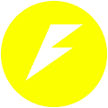

# Fast API Logo Options

## Intermediate RIoT

### Session 11

Developed by Adrian Gould

---

```table-of-contents
title: # Contents
style: nestedList
minLevel: 0
maxLevel: 3
includeLinks: true
```

---

Here are the various Fast API Logo Options...

To use, right mouse click and download the PNG.

| Base Colour     | Logo                      | Base Colour          | Logo                           |
|-----------------|---------------------------|----------------------|--------------------------------|
| FastAPI Green   |  | FastAPI Olive        |        |
| FastAPI Cerise  |  | FastAPI Red Ochre    |     |
| FastAPI Sky     |     | FastAPI Blue Ochre   |    |
| FastAPI Red     |     | FastAPI Ochre        |        |
| FastAPI Indigo  |  | FastAPI Purple Ochre |  |
| FastAPI Yellow  |  | FastAPI Lime Ochre   |    |
| FastAPI Lime    |    | FastAPI Green Ochre  |   |
| FastAPI Gray 1  |    | FastAPI Black        |          |
| FastAPI Blue    |    | FastAPI Blue Ochre   |  |
| FastAPI Purple1 |  | FastAPI Eggplant     |     |
| FastAPI Cyan    |    | FastAPI Gray 3       |         |
| FastAPI Orange  |  | FastAPI Gray 2       |         |

# END

Next up - [LINK TEXT](#)
