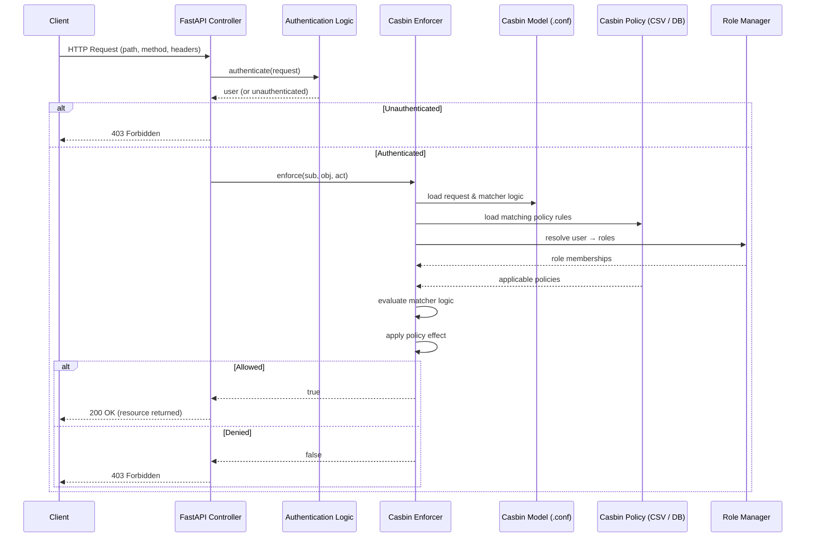

# Authorisation & PyCasbin

<div @click="$slidev.nav.next" class="mt-12 -mx-4 p-4" hover:bg="white op-10">
<p>Press <kbd>Space</kbd> or <kbd>RIGHT</kbd> for next slide/step <fa7-solid-arrow-right /></p>
</div>

<div class="abs-br m-6 text-xl">
  <a href="https://github.com/adygcode/SaaS-FED-Notes" target="_blank" class="slidev-icon-btn">
    <fa7-brands-github class="text-zinc-300 text-3xl -mr-2"/>
  </a>
</div>


<!--
The last comment block of each slide will be treated as slide notes. It will be visible and editable in Presenter Mode along with the slide. [Read more in the docs](https://sli.dev/guide/syntax.html#notes)
-->


---
layout: default
level: 2
---

# Navigating Slides

Hover over the bottom-left corner to see the navigation's controls panel.

## Keyboard Shortcuts

|                                                     |                             |
|-----------------------------------------------------|-----------------------------|
| <kbd>right</kbd> / <kbd>space</kbd>                 | next animation or slide     |
| <kbd>left</kbd>  / <kbd>shift</kbd><kbd>space</kbd> | previous animation or slide |
| <kbd>up</kbd>                                       | previous slide              |
| <kbd>down</kbd>                                     | next slide                  |

---
layout: section
---

# Objectives

---
level: 2
layout: two-cols
---

# Objectives

::left::

...

::right::

...

---
level: 2
layout: figure-side
figureUrl: ./orly-book-cover-blamingtheuser.png
---

# Contents

<Toc minDepth="1" maxDepth="1" columns="2" />

---
layout: section
---

# Ice Breaker

---
level: 2
layout: two-cols
---

# Ice Breaker

::left::

## Discussion Question

<br>

<Announcement type=brainstorm>

- Divide into groups of 3
- Summarise your discussion into 3 key points

</Announcement>

<p>Who decides <strong class="text-amber-600!">who can do what</strong> in 
a system?</p>

<Announcement type=duration>
5 minutes
</Announcement>

::right::

## Reflection

<br>

<Announcement type=idea>

- Reflect on your personal experiences
- Create a list of 3 different applications (one per person)
- No duplicates

</Announcement>

<p>Name one app per person with different user privileges.</p>

<Announcement type=duration>
2 minutes
</Announcement>

<!-- Presenter Notes:
Use student examples like LMS or banking apps.
-->

---
layout: section
---

# What is Authorisation

---
level: 2
---

# What is Authorisation

- Controls what an authenticated user can do
- Happens *after* authentication
- Enforced by backend logic

<!-- Presenter Notes:
Authn vs Authz distinction.
-->

---
layout: section
---

# Access Control Models

---
level: 2
---

# Access Control Models

<div class="leading-2 ">

| Model                                                                                       | Quick Description                                           |
|---------------------------------------------------------------------------------------------|-------------------------------------------------------------|
| <strong class="bg-green-800 px-2 py-2 rounded w-24 inline-block text-center">ABAC</strong>  | attributes-based rules                                      |
| <strong class="bg-gray-800 px-2 py-2 rounded w-24 inline-block text-center">ACL</strong>    | per‑resource lists of users and their allowed actions       |
| <strong class="bg-gray-800 px-2 py-2 rounded w-24 inline-block text-center">DAC</strong>    | resource owners decide who can access their resources       |
| <strong class="bg-gray-800 px-2 py-2 rounded w-24 inline-block text-center">Hybrid</strong> | combines multiple models for flexible, fine‑grained control |
| <strong class="bg-gray-800 px-2 py-2 rounded w-24 inline-block text-center">MAC</strong>    | centrally enforced security labels and clearance rules      |
| <strong class="bg-green-800 px-2 py-2 rounded w-24 inline-block text-center">PBAC</strong>  | policy-driven rules                                         |
| <strong class="bg-gray-800 px-2 py-2 rounded w-24 inline-block text-center">TBAC</strong>   | permissions activated only while performing specific tasks  |
| <strong class="bg-green-800 px-2 py-2 rounded w-24 inline-block text-center">RBAC</strong>  | roles with permissions                                      |
| <strong class="bg-gray-800 px-2 py-2 rounded w-24 inline-block text-center">ReBAC</strong>  | access based on relationships between users and resources   |
| <strong class="bg-gray-800 px-2 py-2 rounded w-24 inline-block text-center">RuBAC</strong>  | access decisions made using explicit logical rules          |

</div>

<!-- Presenter Notes:
Focus on RBAC for this unit.

- RBAC answers: “What role are you?”
- ABAC answers: “What attributes apply right now?”
- PBAC answers: “Do the policies allow this?”
- RBAC answers “What role are you?”
- ABAC answers “What attributes apply right now?”
- PBAC answers “What do the policies say?”
- ACL answers “Are you on the list?”
- DAC answers “Did the owner allow you?”
- MAC answers “Does your clearance match?”
- ReBAC answers “How are you related?”
- TBAC answers “What task are you doing?”
- RuBAC answers “Does the rule evaluate to true?”

Students are expected to know RBAC, ABAC and PBAC conceptually
-->

---
layout: two-cols
level: 2
---

# Access Control Models

## RBAC — Role-Based Access Control

::left::

### What it is:

- Access is granted based on **roles**
- Roles group permissions together

<br>

### How it works:

- Users → roles
- Roles → permissions

::right::

### Examples:

- Admin, staff, student roles
- Enterprise business systems

<br>

### Key Points

- ✅ Simple and easy to manage
- ✅ Scales well
- ❌ Limited flexibility for complex rules

---
layout: two-cols
level: 2
---

# Access Control Models

## ABAC — Attribute-Based Access Control

::left::

### What it is:

- Access decisions based on **attributes**

<br>

### Common attributes:

- User (department, clearance)
- Resource (owner, sensitivity)
- Environment (time, location)

::right::

### Examples:

- Cloud platforms
- Fine-grained data protection

<br>

### Key Points:

- ✅ Very flexible
- ✅ Context-aware decisions
- ❌ More complex to design and manage

<!-- Presenter Notes:

Reinforce that RBAC is the most common model students will encounter.

Emphasise that ABAC evaluates conditions dynamically at runtime.
-->


---
layout: two-cols
level: 2
---

# Access Control Models

## PBAC — Policy-Based Access Control

::left::

### What it is:

- Access governed by **policies**
- Policies define rules independently of code

<br>

### How it works:

- Requests evaluated against policies
- Often implemented via policy engines

::right::

### Examples:

- Enterprise security platforms
- Compliance-driven systems

<br>

### Key Points:

- ✅ Centralised control
- ✅ Highly configurable
- ❌ Policy complexity can grow quickly

<!-- Presenter Notes:
PBAC is often seen as an architectural approach rather than a single model.

-->

---
layout: section
---

# Beyond RBAC, ABAC & PBAC

## Access Control Models

<!-- Presenter Notes:
Introduce this as a broadening of student knowledge.
Explain that RBAC, ABAC and PBAC are common, but not the only models.
-->

---
level: 2
---

# Beyond RBAC, ABAC & PBAC

## Why So Many Models?

Different systems have different needs:

- Simplicity vs flexibility
- Centralised vs user-controlled access
- Static vs dynamic environments

No single model fits all situations.

<!-- Presenter Notes:
Use the phrase “right tool for the job”.
-->

---
level: 2
layout: two-cols
---

# Beyond RBAC, ABAC & PBAC

## ACL – Access Control Lists

::left::

### What it is:

- Each resource lists who can access it

<br>

### How it works:

- User → resource → permission

::right::

### Examples:

- File permissions
- Network device rules

<br>

### Key Points:

✅ Simple  
❌ Poor scalability

<!-- Presenter Notes:
Policies live *on the resource*, not centrally.
-->


---
level: 2
layout: two-cols
---

# Beyond RBAC, ABAC & PBAC

## DAC – Discretionary Access Control

::left::

### What it is:

- Owners decide who can access their resources

::right::

### Examples:

- Operating system files
- Shared folders

<br>

### Key Points

- ✅ Flexible
- ❌ Weak security guarantees

<!-- Presenter Notes:
Explain that users can accidentally over-share.
-->


---
level: 2
layout: two-cols
---

# Beyond RBAC, ABAC & PBAC

## MAC – Mandatory Access Control

::left::

### What it is:

- Central authority enforces labels and clearances

::right::

### Examples:

- Military systems
- Government data systems

<br>

### Key Points

- ✅ Very secure
- ❌ Rigid and hard to manage

<!-- Presenter Notes:
Stress that users cannot override permissions.
-->


---
level: 2
layout: two-cols
---

# Beyond RBAC, ABAC & PBAC

## ReBAC – Relationship-Based Access Control

::left::

### What it is:

- Decisions based on relationships

::right::

### Examples:

- "Friend of"
- "Member of"
- "Owner of"

<br>

### Key Points

- ✅ Natural for social systems
- ❌ Requires relationship graphs

<!-- Presenter Notes:
Good example: social media privacy.
-->


---
level: 2
layout: two-cols
---

# Beyond RBAC, ABAC & PBAC

## TBAC – Task-Based Access Control

::left::

### What it is:

- Permissions tied to tasks or workflows

::right::

### Examples:

- Approval processes
- Business workflows

<br>

### Key Points

- ✅ Least privilege
- ❌ Complex to implement

<!-- Presenter Notes:
Permissions exist only while the task is active.
-->


---
level: 2
layout: two-cols
---

# Beyond RBAC, ABAC & PBAC

## RuBAC – Rule-Based Access Control

::left::

### What it is:

- If-then rules evaluated at runtime

::right::

### Examples:

- Network firewalls
- Policy engines

<br>

### Key Points

- ✅ Very powerful
- ❌ Difficult to maintain

<!-- Presenter Notes:
Rules can become complex quickly.
-->


---
level: 2
layout: two-cols
---

# Beyond RBAC, ABAC & PBAC

## Hybrid Access Control Models

::left::

### What it is:

- Combining multiple models

<br>

### Typical approach:

- RBAC for broad access
- ABAC or rules for fine-grained checks

::right::

### Key Points

- ✅ Practical and flexible
- ❌ Higher complexity

<!-- Presenter Notes:
This is how most real enterprise systems work.
-->

---
layout: section
---

# Access Control Model Comparison

---
level: 2
---

# Access Control Model Comparison

| Model | Decision <br>Based On  | Granularity | Flexibility | Complexity  | Scalability | Common Uses <br>(Examples)                          |
|-------|------------------------|-------------|-------------|-------------|-------------|-----------------------------------------------------|
| ACL   | User–resource mappings | Very Low    | Low         | Low         | Poor        | File systems, network devices, routers              |
| DAC   | Resource ownership     | Low         | Low–Medium  | Low         | Poor        | Desktop OS, shared folders, personal data           |
| MAC   | Security labels        | Medium      | Low         | Medium–High | Medium      | Government, defence, classified systems             |
| RBAC  | Roles                  | Medium      | Medium      | Low–Medium  | High        | Enterprise apps, HR systems, LMS platforms          |
| ABAC  | Attributes (context)   | High        | High        | High        | High        | Cloud services, zero‑trust systems, data protection |

<!-- Presenter Notes:
Don’t read the whole table aloud—highlight trends instead.

Focus students on trade-offs: simplicity vs flexibility.
-->


---
level: 2
---

# Access Control Model Comparison

| Model  | Decision <br>Based On | Granularity | Flexibility | Complexity  | Scalability | Common Uses <br>(Examples)                            |
|--------|-----------------------|-------------|-------------|-------------|-------------|-------------------------------------------------------|
| PBAC   | Policies              | High        | High        | Medium–High | High        | Security platforms, compliance systems, IAM           |
| ReBAC  | Relationships         | High        | Medium–High | Medium      | Medium      | Social networks, collaboration tools                  |
| TBAC   | Tasks / workflows     | Medium      | Medium      | Medium      | Medium      | Business processes, approval workflows                |
| RuBAC  | Rules / logic         | High        | High        | Medium–High | Medium      | Firewalls, policy engines, security tooling           |
| Hybrid | Combined models       | Very High   | Very High   | High        | High        | Enterprise cloud, SaaS platforms, large organisations |

<!-- Presenter Notes:
Don’t read the whole table aloud—highlight trends instead.

Focus students on trade-offs: simplicity vs flexibility.
-->

---
level: 2
---

# Access Control Model Comparison

## Key Takeaways

- **RBAC** is best for clear, stable permissions
- **ABAC** handles complex, dynamic conditions
- **PBAC** provides centralised policy control
- **Other** models solve niche problems
- Real systems often **combine these models** into Hybrid models

<!-- Presenter Notes:
Link this back to Casbin’s ability to support multiple models.
-->

---
layout: section
---

# Implementing Access Control

- Casbin
- PyCasbin
- Policies
- Models

---
level: 2
layout: two-cols
---

# Implementing Access Control - Casbin Key Components

::left::

## Casbin Overview

- Open-source authorisation library
- Supports multiple models
- PyCasbin integrates with FastAPI

::right::

## Casbin Components

We will be using three of the key Casbin components for our example.

- Enforcer
- Policy
- Model

<!-- Presenter Notes:
Stress separation of policy from code.
-->

---
level: 2
layout: two-cols
---

# Implementing Access Control - Casbin Key Components

## Enforcer

::left::

- The Enforcer is the core component of Casbin.
- It is the main interface your application uses to make authorisation
  decisions.

<br>

### What it does:

- Evaluates access requests
- Coordinates the model, policies, roles, and storage
- Answers the question: “Is this request allowed?”

::right::

### Key responsibility:

```
enforce(subject, object, action)
```

<br>

<Announcement type=info>
Without the Enforcer, Casbin does nothing. It is the “engine” of the system
</Announcement>


---
level: 2
layout: two-cols
---

# Implementing Access Control - Casbin Key Components

## Casbin Policy

- The policy stores the actual permission rules.

::left::

### What it defines

Who can do what
Which roles exist
Which users belong to which roles

<br>

### Common formats

- CSV files (simple demos)
- Databases (real systems)
- In‑memory policies (testing)

<br>

### Why the Policy Matters

Policies are data, not logic. Logic lives in the model.

::right::

### Casbin Policy Overview

```csv
p, admin, /secure/users/add, POST
p, admin, /secure/users/list, GET
p, staff, /secure/users/list, GET
g, jane, admin
g, bill, staff
```

<!-- Presenter Notes:
Walk policy line by line.
-->


---
level: 2
layout: two-cols
---

# Implementing Access Control - Casbin Key Components

## Model

- The model defines how access control decisions are made.
- Separation (model/policy) allows changing authorisation logic without
  update to application code.

::left::

#### What it contains

- <strong class="text-orange-600">R</strong>equest definition (what makes up a
  request)
- <strong class="text-orange-600">P</strong>olicy definition (what a rule
  looks like)
- Policy <strong class="text-orange-600">E</strong>ffect (how allow/deny is
  decided)
- <strong class="text-orange-600">M</strong>atchers (the logic that compares a
  request to policies)

::right::

#### Why the model matters

- Determines whether Casbin behaves like **RBAC**, **ABAC**, **ACL**, or a *
  *hybrid**
- Defined in .conf files using the **PERM** structure

<!-- Presenter Notes:
Explain model governs decision logic.
-->


---
level: 2
layout: two-cols
---

# Implementing Access Control - Casbin Key Components

## Model Overview

::left::

#### Request Definition Section

```ini {1-2}
[request_definition]
r = sub, obj, act

[policy_definition]
p = sub, obj, act

[role_definition]
g = _, _

[policy_effect]
e = some(where (p.eft == allow))

[matchers]
m = (g(r.sub, p.sub) || r.sub == p.sub) ↩
    ↪ && r.obj == p.obj ↩
    ↪ && r.act == p.act
```

<small class="-my-2 block text-xs">Matcher is one line (↩
↪ symbols), spacing important</small>

::right::

#### What this means

This section defines what information makes up an access request.

| Field | Meaning                                                                          | Example            |
|-------|----------------------------------------------------------------------------------|--------------------|
| sub   | Subject <br><span class="text-yellow-600 text-sm">(who is requesting)    </span> | jane               |
| obj   | Object <br><span class="text-yellow-600 text-sm">(what is being accessed)</span> | /secure/users/list |
| act   | Action <br><span class="text-yellow-600 text-sm">(what they want to do)  </span> | GET                |

---
level: 2
layout: two-cols
---

# Implementing Access Control - Casbin Key Components

## Model Overview

::left::

#### Request Definition Section

```ini {1-2}
[request_definition]
r = sub, obj, act

[policy_definition]
p = sub, obj, act

[role_definition]
g = _, _

[policy_effect]
e = some(where (p.eft == allow))

[matchers]
m = (g(r.sub, p.sub) || r.sub == p.sub) ↩
    ↪ && r.obj == p.obj ↩
    ↪ && r.act == p.act
```

<small class="-my-2 block text-xs">Matcher is one line (↩
↪ symbols), spacing important</small>

::right::

#### In practice

When your application calls:

```python
enforcer.enforce("jane", 
                 "/secure/users/list", 
                 "GET")
```

Casbin internally creates this request:

```
r.sub = jane
r.obj = /secure/users/list
r.act = GET
```

- This maps directly to HTTP requests
- Keeps requests simple and predictable

<!-- Presenter Notes:

-->


---
level: 2
layout: two-cols
---

# Implementing Access Control - Casbin Key Components

## Model Overview

::left::

#### Policy Definition Section

```ini {4-5}
[request_definition]
r = sub, obj, act

[policy_definition]
p = sub, obj, act

[role_definition]
g = _, _

[policy_effect]
e = some(where (p.eft == allow))

[matchers]
m = (g(r.sub, p.sub) || r.sub == p.sub) ↩
    ↪ && r.obj == p.obj ↩
    ↪ && r.act == p.act
```

<small class="-my-2 block text-xs">Matcher is one line (↩
↪ symbols), spacing important</small>

::right::

#### What this means

This defines what a policy rule looks like.

Each policy rule contains:

- Who (usually a role)
- What resource
- Which action

<!-- Presenter Notes:
-->

---
level: 2
layout: two-cols
---

# Implementing Access Control - Casbin Key Components

## Model Overview

::left::

#### Policy Definition Section

```ini {4-5}
[request_definition]
r = sub, obj, act

[policy_definition]
p = sub, obj, act

[role_definition]
g = _, _

[policy_effect]
e = some(where (p.eft == allow))

[matchers]
m = (g(r.sub, p.sub) || r.sub == p.sub) ↩
    ↪ && r.obj == p.obj ↩
    ↪ && r.act == p.act
```

<small class="-my-2 block text-xs">Matcher is one line (↩
↪ symbols), spacing important</small>

::right::

#### Example policy row

```csv
p, admin, /secure/users/list, GET
```

<br>

#### Interpreted as:

- Users in the **`admin`** role <br>may **`GET /secure/users/list`**

<br>

#### Key idea

- Requests `r` are compared against policies `p`

<!-- Presenter Notes:
-->


---
level: 2
layout: two-cols
---

# Implementing Access Control - Casbin Key Components

## Model Overview

::left::

#### Role Definition Section

```ini {7-8}
[request_definition]
r = sub, obj, act

[policy_definition]
p = sub, obj, act

[role_definition]
g = _, _

[policy_effect]
e = some(where (p.eft == allow))

[matchers]
m = (g(r.sub, p.sub) || r.sub == p.sub) ↩
    ↪ && r.obj == p.obj ↩
    ↪ && r.act == p.act
```

<small class="-my-2 block text-xs">Matcher is one line (↩
↪ symbols), spacing important</small>

::right::

#### What this means

This enables grouping (role) relationships.

The `g` function maps the `user` to the `role`.

```
g(user, role)
```

<!-- Presenter Notes:
-->

---
level: 2
layout: two-cols
---

# Implementing Access Control - Casbin Key Components

## Model Overview

::left::

#### Role Definition Section

```ini {7-8}
[request_definition]
r = sub, obj, act

[policy_definition]
p = sub, obj, act

[role_definition]
g = _, _

[policy_effect]
e = some(where (p.eft == allow))

[matchers]
m = (g(r.sub, p.sub) || r.sub == p.sub) ↩
    ↪ && r.obj == p.obj ↩
    ↪ && r.act == p.act
```

<small class="-my-2 block text-xs">Matcher is one line (↩
↪ symbols), spacing important</small>

::right::

#### Example grouping rules

```csv
g, jane, admin
g, bill, staff
```

- Jane belongs to the admin role
- Bill belongs to the staff role

<br>

#### Why the underscores (_, _)?

- Casbin doesn’t enforce specific names
- The function takes two parameters

This:

- Enables RBAC
- Allows users to have multiple roles

<!-- Presenter Notes:
-->

---
level: 2
layout: two-cols
---

# Implementing Access Control - Casbin Key Components

## Model Overview

::left::

#### Policy Effect Section

```ini {10-11}
[request_definition]
r = sub, obj, act

[policy_definition]
p = sub, obj, act

[role_definition]
g = _, _

[policy_effect]
e = some(where (p.eft == allow))

[matchers]
m = (g(r.sub, p.sub) || r.sub == p.sub) ↩
    ↪ && r.obj == p.obj ↩
    ↪ && r.act == p.act
```

<small class="-my-2 block text-xs">Matcher is one line (↩
↪ symbols), spacing important</small>

::right::

#### What this means

This tells Casbin how to combine multiple matching rules.

<Announcement type=info title="Plain English">
If any matching policy allows access → allow the request
</Announcement>

<br>

#### Why this matters

- Multiple policies may match one request
- Casbin needs to know how to resolve them

<!-- Presenter Notes:
-->

---
level: 2
layout: two-cols
---

# Implementing Access Control - Casbin Key Components

## Model Overview

::left::

#### Policy Effect Section

```ini {10-11}
[request_definition]
r = sub, obj, act

[policy_definition]
p = sub, obj, act

[role_definition]
g = _, _

[policy_effect]
e = some(where (p.eft == allow))

[matchers]
m = (g(r.sub, p.sub) || r.sub == p.sub) ↩
    ↪ && r.obj == p.obj ↩
    ↪ && r.act == p.act
```

<small class="-my-2 block text-xs">Matcher is one line (↩
↪ symbols), spacing important</small>

::right::

#### Behaviour Summary

- This is the most important part of the model.
- The matcher defines the exact logic used to compare a request to a policy.

<br>

#### Role definition ...

- Simple allow‑based logic
- Common for RBAC systems

<!-- Presenter Notes:
-->

---
level: 2
layout: two-cols
---

# Implementing Access Control - Casbin Key Components

## Model Overview

::left::

#### Matcher Section

```ini {13-16}
[request_definition]
r = sub, obj, act

[policy_definition]
p = sub, obj, act

[role_definition]
g = _, _

[policy_effect]
e = some(where (p.eft == allow))

[matchers]
m = (g(r.sub, p.sub) || r.sub == p.sub) ↩
    ↪ && r.obj == p.obj ↩
    ↪ && r.act == p.act
```

<small class="-my-2 block text-xs">Matcher is one line (↩
↪ symbols), spacing important</small>

::right::

#### What this means

This tells Casbin how to combine multiple matching rules.

<Announcement type=info title="Plain English" width=full>

**If** any matching policy allows access<br>
**then** allow the request

</Announcement>

<br>

#### Why this matters

- Multiple policies may match one request
- Casbin needs to know how to resolve them

<!-- Presenter Notes:
-->


---
level: 2
layout: two-cols
---

# Implementing Access Control - Casbin Key Components

## Model Overview

::left::

#### Role Definition Section

```ini {14}
[request_definition]
r = sub, obj, act

[policy_definition]
p = sub, obj, act

[role_definition]
g = _, _

[policy_effect]
e = some(where (p.eft == allow))

[matchers]
m = (g(r.sub, p.sub) || r.sub == p.sub) ↩
    ↪ && r.obj == p.obj ↩
    ↪ && r.act == p.act
```

<small class="-my-2 block text-xs">Matcher is one line (↩
↪ symbols), spacing important</small>

::right::

#### Matcher Breakdown - Role or Direct Match

This checks either:

- The user belongs to the role stated in the policy, OR
- The policy directly names the user

This:

- Supports RBAC
- Supports direct user permissions

<br>

#### Example:

- g(jane, admin) → true
- jane == jane → true

<!-- Presenter Notes:
-->

---
level: 2
layout: two-cols
---

# Implementing Access Control - Casbin Key Components

## Model Overview

::left::

#### Role Definition Section

```ini {15}
[request_definition]
r = sub, obj, act

[policy_definition]
p = sub, obj, act

[role_definition]
g = _, _

[policy_effect]
e = some(where (p.eft == allow))

[matchers]
m = (g(r.sub, p.sub) || r.sub == p.sub) ↩
    ↪ && r.obj == p.obj ↩
    ↪ && r.act == p.act
```

<small class="-my-2 block text-xs">Matcher is one line (↩
↪ symbols), spacing important</small>

::right::

#### Matcher Breakdown - Object Match

Checks that:

- The requested resource matches the policy resource exactly

For example, that:

- `/secure/users/list` must match `/secure/users/list`

<br> 

#### Note that:

- Pattern matching not used here
- Enforces strict URL matching

<!-- Presenter Notes:
-->

---
level: 2
layout: two-cols
---

# Implementing Access Control - Casbin Key Components

## Model Overview

::left::

#### Role Definition Section

```ini {16}
[request_definition]
r = sub, obj, act

[policy_definition]
p = sub, obj, act

[role_definition]
g = _, _

[policy_effect]
e = some(where (p.eft == allow))

[matchers]
m = (g(r.sub, p.sub) || r.sub == p.sub) ↩
    ↪ && r.obj == p.obj ↩
    ↪ && r.act == p.act
```

<small class="-my-2 block text-xs">Matcher is one line (↩
↪ symbols), spacing important</small>

::right::

#### Matcher Breakdown - Action Match

Checks:

- HTTP method must match exactly<br>(`GET`, `POST`, etc.)

For example:

- `GET` ≠ `POST`

<br> 

#### Note that:

- There is a clear separation of read vs write operations

<!-- Presenter Notes:
-->

---
layout: section
---

# Implementing RBAC with PyCasbin

---
level: 2
layout: two-cols
---

# Implementing RBAC with PyCasbin

::left::

### Requirements

- PyCharm
- Python 3.10+
- Bash CLI
- Patience

::right::

### Actions to perform

- Create project & folders
- Create venv & activate
- Create empty files
- Code!

---
level: 2
---

# Implementing RBAC with PyCasbin

## Setting up

Execute these commands in a BASH CLI.

#### Create the project folder

```shell
mkdir fastapi-demo-casbin
cd fastapi-demo-casbin
```

#### Install & Activate Python Virtual Environment

```shell
python -m venv .venv
source ./.venv/scripts/activate
```

#### Create Empty Files

```shell
touch app.py users.csv
touch casbin_model.conf
touch casbin_policy.csv
```

---
level: 2
---

# Implementing RBAC with PyCasbin

## Setting up 2

Ensure that you have activated the Python "venv" before continuing...

```shell
source ./.venv/Scripts/activate
```

Look for responses with (venv) that should be similar to:

```text
(.venv)
USERNAME@COMPUTER_NAME MINGW64 fastapi-demo-casbin (main)
```

#### Install the required Python modules

```shell
pip install fastapi uvicorn
pip install pycasbin
pip install python-multipart
```

---
level: 2
---

# Implementing RBAC with PyCasbin

## Setting up 3

#### Freeze the requirements for future requirements

```shell
pip freeze > requirements.txt
```

#### Run the application

```shell
uvicorn app:app --reload
```

#### Stopping the Application

If you need to stop the application use <kbd>CTRL</kbd>+<kbd>C</kbd> to
halt the execution.

<hr class="my-6 border-0 border-b-1 border-b-red-700 " />

<Announcement type=important title="Clone & Run">
To clone and execute a Python based application's use this basic method:

1. Change into the folder `cd FOLDER_NAME`
2. Create the Python virtual environment [venv] `python -m venv .venv`,
3. Active the venv `source ./.venv/scripts/activate`,
4. Install requirements  `pip install -r requirements.txt`.

</Announcement>


<!-- Presenter Notes:
Walk through request lifecycle.
-->


---
level: 2
---

# Implementing RBAC with PyCasbin

## Worked Demo Flow

1. Authenticate user
2. Call Casbin enforcer
3. Evaluate model + policy
4. Allow or deny

We show a sequence diagram for our implementaion with Casbin on the next
slide...


---
level: 2
---

# Implementing RBAC with PyCasbin

<div class="w-10/12 mx-auto">



</div>


<!-- Presenter notes 

How to Read This Diagram (Presenter‑Friendly)

**1. Client Request**

The client sends an HTTP request containing:
- URL path (obj)
- HTTP method (act)
- Authentication headers (sub)


**2. Authentication (Outside Casbin)**

Casbin does not authenticate users.

Your application:
- Verifies credentials
- Identifies the user (subject)

If authentication fails → request is rejected before Casbin is called.

**3. Casbin Enforcement Call**

The application calls:

```python
enforcer.enforce(subject, object, action)
```

Example:
```python
enforcer.enforce("jane", "/secure/users/list", "GET")
```

**4. Model, Policy, and Role Resolution**

Inside Casbin:

- Model defines how to compare requests
- Policy provides permission rules
- Role Manager resolves role inheritance <br> (e.g. jane → admin)


**5. Matcher Evaluation**

Casbin checks:

- Does the user have the required role?
- Does the object match?
- Does the action match?


**6. Policy Effect**

Casbin applies the policy effect rule:
- At least one allow → ✅ allowed
- No allow → ❌ denied

**7. Decision Returned**

Casbin returns:
- true → API continues
- false → API denies access

-->

---
level: 2
---

# Implementing RBAC with PyCasbin

Now we can implement our example using Python.

We will:

- Add policy file content
- Add model file content
- Add users file content
- Add app file code
- Execute the application
- Test the endpoints (CURL and Bruno/Postman)
- Look at the automatically generated documentation

---
level: 2
---

# Implementing RBAC with PyCasbin

## Add policy file content

Open the `casbin_policy.csv`

Add the following:

```csv {1|2|3|5|6|7}
p, admin, /secure/users/add, POST
p, admin, /secure/users/list, GET
p, staff, /secure/users/list, GET

g, jane, admin
g, bill, staff
g, romeo, staff
```

<br>

<Announcement type=important class="mt-8">
Make sure you get spacing correct, and <strong>do not</strong> use 
<kbd>TAB</kbd> characters.
</Announcement>


---
level: 2
---

# Implementing RBAC with PyCasbin

## Add model file content

Just as we have don with the Policy file,m we now create the Casbin Model
File.

Open the `casbin_model.conf` file and add:

```ini
[request_definition]
r = sub, obj, act

[policy_definition]
p = sub, obj, act

[role_definition]
g = _, _

[policy_effect]
e = some(where (p.eft == allow))

[matchers]
m = (g(r.sub, p.sub) || r.sub == p.sub) && r.obj == p.obj && r.act == p.act

```

<Announcement type=important class="mt-8">
Make sure you get spacing correct, and <strong>do not</strong> use 
<kbd>TAB</kbd> characters.
</Announcement>


---
level: 2
---

# Implementing RBAC with PyCasbin

## Add users file content

The `users.txt` file is our "database" of users and passwords.

Open this file and add your test users:

```csv
username,password
jane,secret123
bill,secret123
```

<Announcement type=important class="mt-8">
Make sure you get spacing correct, and <strong>do not</strong> use 
<kbd>TAB</kbd> characters.
</Announcement>

---
level: 2
layout: two-cols
---

# Implementing RBAC with PyCasbin

## Implement Applicaiton Code

::left::

We are now ready to create the main application.

This will be done in the following steps:

- Import modules
- Create application instance
- Create/Activate the Casbin Enforcer
- Helpers
- Routes

::right::

## File Heading

For completeness, we will add an informational Python docblock heading to the
file:

```python
"""
FastAPI & Casbin Demonstration

Author:           YOUR NAME <EMAIL_ADDRESS>
Version:          1.0
"""

"""
------------------------------------
Import modules
------------------------------------
"""
```

---
level: 2
layout: two-cols
---

# Implementing RBAC with PyCasbin

## Application Code: Imports

::left::

```python
"""
------------------------------------
Import modules
------------------------------------
"""

import csv
import casbin
from fastapi import FastAPI, Depends, 
from fastapi import HTTPException, Request

```

::right::

We now have the following classes ready for our development:

- `FastAPI`,
- `Depends`,
- `HTTPException` and
- `Request`

Also:

- `csv` module allows us to work with Comma Separated Variable
  files (CSV),
- `casbin` is the PyCasbin implementation of the Casbin authorisation library.

---
level: 2
layout: two-cols
---

# Implementing RBAC with PyCasbin

## Application Code: Application instance

::right::

```python
"""
------------------------------------
Create application instance
------------------------------------
"""

app = FastAPI()
```

::left::

A simple, one-liner to create an instance of the FastAPI class, and thus a
web-application.

This is saved in the `app` variable.

---
level: 2
layout: two-cols
---

# Implementing RBAC with PyCasbin

## Application Code: Casbin Enforcer

Next is the creation of the "Enforcer" - aka doorman - to the applicaiton.

The enforcer uses the models and policies to determine who is allowed to
access which actions within the application.

::left::

```python
"""
------------------------------------
Create/Activate the Casbin Enforcer
------------------------------------
"""

enforcer = casbin.Enforcer(
    "casbin_model.conf",
    "casbin_policy.csv"
)

```

::right::

<Announcement type=warning title="Re-runs" class="mt-8">

If any change is made to the model or policy files, then the application
<strong>must</strong> be stopped and restarted.

`uvicorn` does not restart itself to reload the content of these files.

</Announcement>

---
level: 2
layout: two-cols
---

# Implementing RBAC with PyCasbin

## Application Code: Define Helpers

The helpers are methods that are used to perform actions such as:

- get a list of valid system users
- authenticate the user details
- authorise the user against teh Casbin policies and model

::left::

#### The get users helper...

- Opens the `USERS_FILE` for reading by the csv module
- Reads the users from the `USERS_FILE`
- Converts the "dictionary" of users (from the CSV file) into a list
- Returns the list of users to the calling code

::right::

```python
"""
------------------------------------
Helpers
------------------------------------
"""

USERS_FILE = "users.csv"

def get_users():
    with open(USERS_FILE, newline="") as csvfile:
        user_dictionary = csv.DictReader(csvfile)
        user_list = list(user_dictionary)
        return user_list
```

---
level: 2
layout: two-cols
---

# Implementing RBAC with PyCasbin

## Application Code: Define Helpers

::left::

#### The authenticate helper:

- Accepts request data from the caller
- Extracts the username and password
- Verifies:
    - if username and password are set
    - if the username and password exist in the list of users
- Returns None if any fail, if not the username is returned

This identifies if the user has logged in (`username`) or not (`None`)

::right::

```python
def authenticate(request: Request):
    username = request.headers.get("x-username")
    password = request.headers.get("x-password")

    if not username or not password:
        return None
        
    users_list = get_users()
    for user in users_list:
        if user["username"] == username and ↩
           ↪ user["password"] == password:
            return username

    return None
```

<Announcement type=default title="Note" class="mt-8">
The ↩ and  ↪ are used to show a line that is not split in the IDE.
</Announcement>

---
level: 2
layout: two-cols
---

# Implementing RBAC with PyCasbin

## Application Code: Define Helpers

Final helper is the Authorize method.

This accepts the `username`, the `obj` and `act`.

- `username` -- The name of the authenticated user
- `obj` -- The endpoint that is attempting to be accessed
- `act` -- The HTTP method being used

```python
def authorize(username: str, obj: str, act: str):
    if not enforcer.enforce(username, obj, act):
        return HTTPException(status_code=401, detail="Incorrect username or password")
```

::left::

#### The enforcer verifies that:

1. the `username` attempting to access
2. the `obj`
3. with the `act` method is in the policies

::right::

#### When:

- Yes: no error is thrown.
- No: a 401, not authorised error is thrown by the application.

---
level: 2
---

# Implementing RBAC with PyCasbin

## Application Code: Define Routes/Endpoints

```python

"""
------------------------------------
Routes
------------------------------------
"""


@app.get('/insecure')
def insecure():
    return {"detail": "Welcome to Insecure Endpoint"}

```

---
level: 2
---

# Implementing RBAC with PyCasbin

## Application Code: Define Routes/Endpoints

```python


@app.get('/secure')
def secure(request: Request):
    user = authenticate(request)
    if not user:
        raise HTTPException(status_code=401, detail="Incorrect username or password")
    return {"detail": "Authenticated"}


```

---
level: 2
---

# Implementing RBAC with PyCasbin

## Application Code: Define Routes/Endpoints

```python

@app.get('/secure/users/list')
def list_users(request: Request):
    user = authenticate(request)
    if not user:
        raise HTTPException(status_code=401, detail="Incorrect username or password")

    authorize(user, "/secure/users/list", "GET")

    return {
        "users": [{"name": a_user["username"]} for a_user in get_users()]
    }


```

---
level: 2
---

# Implementing RBAC with PyCasbin

## Application Code: Define Routes/Endpoints

```python

@app.post('/secure/users/add')
def add_user(data: dict, request: Request):
    user = authenticate(request)
    if not user:
        raise HTTPException(status_code=401, detail="Incorrect username or password")

    authorize(user, "/secure/users/add", "POST")

    new_user = data.get("user")
    if not new_user or "name" not in new_user or "password" not in new_user:
        raise HTTPException(status_code=400,
                            detail="Invalid data payload, missing user and/or password fields")

    # Add the user to the users file
    with open("users.csv", "a") as csvfile:
        writer = csv.writer(csvfile)
        writer.writerow([new_user["name"], new_user["password"]])

    return {"detail": "User added successfully", "user": {"name": new_user["name"]}}

```

---
level: 2
---

# Implementing RBAC with PyCasbin

## TODO: Execute the application

At this point, if you have executed the `uvicorn` command, then stop it
using <kbd>CTRL</kbd>+<kbd>C</kbd>.

Re-run the application in testing/development mode using:

```shell
uvicorn app:app --reload --host=127.0.0.1 --port=3000
```

---
level: 2
---

# Implementing RBAC with PyCasbin

## TODO: Test the endpoints (CURL and Bruno/Postman)

---
level: 2
---

# Implementing RBAC with PyCasbin

## TODO: Look at the automatically generated documentation

---

## Summary

- RBAC simplifies access control
- Casbin externalises rules
- Enforcer protects endpoints

<!-- Presenter Notes:
Reinforce learning outcomes.
-->


---

# Acknowledgements & References

## References (APA 7)

Casbin. (2024). *Casbin documentation: Overview*. Apache Software
Foundation. https://casbin.apache.org/docs/overview

FastAPI. (2026). *FastAPI documentation*. https://fastapi.tiangolo.com/

Sandhu, R. S., Coyne, E. J., Feinstein, H. L., & Youman, C. E. (1996).
Role‑based access control models. *IEEE Computer, 29*(2),
38–47. https://doi.org/10.1109/2.485845

Ferraiolo, D. F., Kuhn, D. R., & Chandramouli, R. (2007). *Role‑based access
control* (2nd ed.). Artech House.

Relington, J. (2025). *Role‑ and attribute‑based access control (RBAC/ABAC):
Identity in cybersecurity*. Independently published.

Bellis, B., Fleury, T., & Kim, T. W. (2008). *Access control, authentication,
and public key infrastructure*. Jones & Bartlett.


> - Some content was generated with the assistance of Microsoft Copilot

---
layout: end
---

# Fin!

### Authorisation Haiku

- ...
